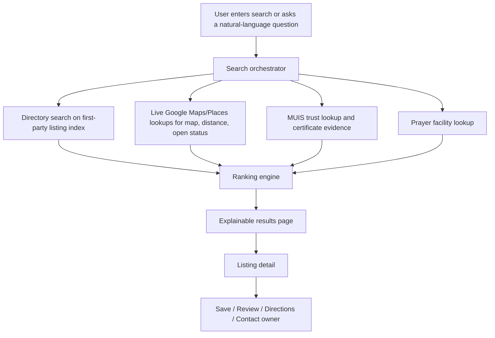
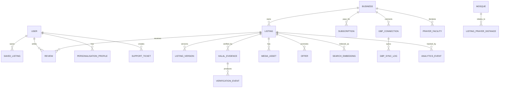

# Humble Halal Research

## Executive summary

**Humble Halal Research** has a strong opportunity in Singapore if it is positioned as a **trust-first Muslim discovery layer**, not just another food directory. The strongest local anchors are already visible: MUIS provides the official consumer search for halal-certified eating establishments, MUIS introduced digital halal certificates with QR codes from **1 October 2025**, and MuslimSG already offers “Halal Makan Places” alongside prayer-related utilities. That means the product should differentiate on **verification depth, explainable ranking, owner tooling, AI-assisted discovery, and a better research experience**, rather than merely re-listing places. citeturn20view3turn8search2turn34search0turn23search1

The most important design constraint is legal and architectural: **Google Maps Platform content cannot be used as the canonical master dataset for a directory**. Google’s current Maps Platform Terms say customers must not copy and save business names, addresses, or user reviews from Google Maps content, and must not use Google Maps Core Services in a listings or directory service. Separately, Places API policies say you must not pre-fetch, cache, or store Places content beyond permitted exceptions, while **place IDs** are explicitly exempt and may be stored indefinitely. In practice, this means Humble Halal Research should treat Google integrations as **live enrichment, navigation, proximity, mapping, owner-authorized sync, and on-demand lookup**, while the product’s master records should be **first-party merchant submissions, MUIS-linked verification records, editorial research, and user-generated data collected directly by your platform**. citeturn37view0turn36view0turn36view1

Google AI Studio is a very strong fit for prototyping and even early production scaffolding. Google documents that AI Studio Build mode can generate **full-stack web apps**, with a **React frontend by default**, a **Node.js server runtime**, secrets stored server-side, automatic setup for **Firebase Firestore and Authentication**, and deployment to **Cloud Run**. Google also documents structured outputs, function calling, and combinations of built-in tools with custom tools—exactly what you need for listing ingestion, verification workflows, search orchestration, chat, and analytics copilots. citeturn35view0turn6search0turn6search1turn7search9turn7search11

For localisation, the safest pattern is: keep the product UI and your own content model multilingual, use Places API `languageCode` when retrieving permitted Google place details, and use Gemini for translation/rewriting where needed. Google Search grounding works across languages, but Google Maps grounding currently has an important limitation: it supports **English prompts and responses only** in Google’s current documentation. That means English should be the operational language for the location-grounding layer, while Malay and optional Arabic should be handled by your platform layer. citeturn12search0turn12search1turn12search21

The best product strategy is therefore:

1. Build a **Singapore-first halal trust graph** centred on MUIS certification, digital certificate QR validation, merchant-provided evidence, and transparent status labels. citeturn8search2turn8search3turn20view3  
2. Use Google data compliantly for **maps, live details, proximity, reviews display where permitted, and owner integrations**, but not as the permanent directory database. citeturn37view0turn36view0turn12search14  
3. Add AI where it improves operations and trust: **ingestion triage, verification assistance, relevance ranking, recommendations, chatbot support, review analysis, and controlled content generation**. citeturn6search0turn6search1turn7search0turn7search3  
4. Monetise with **subscriptions, premium owner tools, clearly labelled sponsored placements, leads, and possibly embedded payments later**—without contaminating the organic trust score. citeturn14search0turn14search1turn13search0

## Market and regulatory context

Singapore already has several adjacent or overlapping products, but none appears to combine **official local halal trust signals, owner tooling, explainable ranking, AI-assisted research, and a modern product stack** in one place. MUIS provides the official halal-certified establishment search; MuslimSG provides a halal makan directory plus prayer-time-oriented utility; Have Halal Will Travel offers editorial/discovery with multiple travel-facing categories and filters; HalalTrip blends restaurant discovery with travel and prayer tools; and Zabihah offers a mature global community directory with granular halal-status and prayer-space data. This confirms there is real product space for a **Singapore-native, verification-heavy, B2B2C directory**. citeturn20view3turn34search0turn20view0turn21view3turn20view2

Because the brand is **Humble Halal Research**, the right positioning is not “the biggest list,” but “the most trustworthy halal decision engine for Singapore.” That has two advantages. First, it aligns tightly with MUIS’s consumer-search and digital certificate direction. Second, it avoids competing head-on with editorial travel brands on content volume alone. The product should explicitly surface the evidence behind every trust label: **MUIS verified**, **merchant-submitted, pending review**, **research-confirmed but not certified**, or **insufficient evidence**. That kind of explainability is also more aligned with Singapore’s broader AI-governance posture. citeturn8search2turn20view3turn26search0turn26search10

| Directory / product | What it already does well | Gaps that Humble Halal Research can fill | Evidence |
|---|---|---|---|
| **MUIS consumer halal search** | Official halal-certified establishment search; strongest certification authority; consumer information anchored to MUIS | Limited product-style discovery, personalisation, review intelligence, owner CRM, and rich UX | citeturn20view3turn8search2turn8search3 |
| **MuslimSG Halal Makan Places** | Officially associated ecosystem; halal makan directory; app also promotes prayer times and related Muslim utilities | More content/community-driven than operator-oriented; less visible B2B dashboarding and ranking transparency | citeturn34search0turn34search7 |
| **Have Halal Will Travel** | Discovery-led UX; categories such as Eat, See & Do, Buy, Stay, Pray; filters by establishment type, neighbourhood, Google rating | Travel/editorial-first; less emphasis on official Singapore halal verification workflow and owner operations | citeturn20view0 |
| **HalalTrip** | “Halal Restaurants Near Me,” “Mosque Near Me,” qibla direction, prayer tools, app distribution | Travel-suite orientation rather than local business intelligence, verification workflow, or Singapore compliance emphasis | citeturn21view3 |
| **Zabihah** | Large global scale; prayer spaces; halal-status nuance; alcohol-free filters; community curation; HalalRank | Not Singapore-official, and not anchored to MUIS digital certificate verification or local owner tooling | citeturn20view2 |

A very important context signal for prayer-related ranking is that Singapore has a strong official mosque data backbone. MUIS provides a mosque directory and Friday-prayer information, while MuslimSG also exposes mosque-finding experiences. That makes it realistic to compute a **nearby-prayer-facility score** by combining: on-premise prayer-room claims, “prayer allowed upon request” flags, and distance to official mosques from MUIS. citeturn23search0turn23search1turn23search3turn23search2

## Product blueprint and user experience

The product should be designed around **four operating surfaces**: a consumer-facing discovery app, a business-owner portal, an admin/moderation console, and backend automation services. Google AI Studio Build mode is useful for rapidly standing up the first version because it supports React, Node.js, Firebase Auth/Firestore, secrets, and Cloud Run deployment; but the production information architecture must remain platform-owned and policy-aware. citeturn35view0turn36view0turn37view0

The **consumer experience** should feel like a trusted halal research assistant. The homepage should let users search by free text or natural language, then immediately pivot between **list, map, and research-card views**. Every listing card should expose the trust summary first: halal certification status, last verification date, whether a QR certificate was checked, type of cuisine, price band, distance, prayer facilities, and “why this result” reasoning. Google-derived map and directions functionality should remain live-linked, while the platform’s own trust narrative comes from first-party and MUIS-linked records. Places API supports live fields like rating, reviews, price level, opening states, accessibility options, and payment options; MUIS provides the official certified establishment search and digital certificate direction. citeturn4search14turn22view0turn22view2turn22view3turn20view3turn8search2

The **business-owner dashboard** should be claim-first and action-oriented. The owner flow should allow: claim listing, connect Google Business Profile, upload or scan MUIS halal certificate evidence, define cuisine and menu tags, set prayer-facility attributes, update photos and offers, respond to platform reviews, and—if the owner authorises it—sync selected fields with Google Business Profile or handle Google review reply workflows. Google’s Business Profile APIs support location management, review listing and replies, place action links, notifications via Pub/Sub, and performance reporting, which makes owner tooling a major differentiator. citeturn5search1turn5search9turn5search13turn29search4turn29search6turn5search3turn15search5

The **admin dashboard** should be heavier than a normal CMS. It needs queues for listing ingestion, certificate-review workflows, manual override of trust status, complaint handling, review moderation, fraud detection, ranking audits, sponsor-labelling control, owner-subscription management, and analytics. It should also store evidence snapshots such as merchant-uploaded documents, QR verification outcomes, notes from researchers, and all user-visible status changes, because both PDPA accountability and trustworthy AI governance reward traceability and role clarity. citeturn25search0turn25search10turn26search0

A concise feature map for launch planning is below.

| Surface | MVP | Later expansion |
|---|---|---|
| **Consumer app** | Search, filters, map/list view, save favourites, trust badges, reviews, nearby mosques/prayer score, English UI | Personalised feed, itineraries, voice search, Arabic/Malay UI, family mode, wheelchair/pram filters |
| **Owner portal** | Claim listing, connect Google Business Profile, submit certificate, edit profile, prayer-facility fields, offers, view basic analytics | Menu OCR ingestion, campaign manager, CRM messaging, coupon engine, reservation/waitlist links |
| **Admin console** | Review queue, verification queue, abuse reports, ranking controls, subscriptions, audit logs | Risk-scoring automation, agent-based moderation, anomaly detection, bulk import tools |
| **AI layer** | Ingestion assistant, ranking assistant, chat helper, review sentiment | Predictive demand, owner growth copilot, campaign recommendations, category expansion tools |
| **Monetisation** | Free listings, paid premium owner plan, sponsored slots clearly labelled | Lead fees, embedded payments, booking commissions, API/licensing for partners |

The user experience should remain simple, but the evidence model should be rich. A good flow is:



For wireframes, the highest-value reusable components are: a **trust badge ribbon**, **evidence accordion**, **sticky filter bar**, **map/list toggle**, **owner-verified banner**, **nearby mosque chip**, **halal certificate QR scanner modal**, **review-sentiment sparkline**, **“why this result” drawer**, and an **organic vs sponsored label component**. These components reinforce the platform’s research-led identity and reduce ambiguity about whether a result is officially certified, platform-reviewed, or merely merchant-claimed. citeturn8search2turn20view3turn26search0

## Data architecture, ranking, and APIs

The best production architecture is a **GCP-first, server-side, policy-aware stack**. For the core transactional store, use **PostgreSQL on Cloud SQL** with **PostGIS** for geospatial search and **pgvector** for semantic search/recommendation; Cloud SQL officially supports pgvector. If the product grows into higher-scale semantic search or mixed transactional/analytical AI workloads, **AlloyDB** becomes a strong later upgrade because Google positions it for low-latency AI with native vector capabilities. Cloud Run is the best initial compute substrate because it automatically scales containers up and down, while AI Studio Build mode can already target Cloud Run. citeturn16search4turn16search3turn28search1turn28search3turn27search23turn35view0

A pragmatic stack recommendation is below.

| Layer | Recommended choice | Why |
|---|---|---|
| Frontend web | **Next.js / React** | AI Studio Build mode uses React by default for web apps, making prototype-to-production migration easier. citeturn35view0 |
| Backend API | **Node.js / TypeScript** with NestJS or Express on Cloud Run | AI Studio generates a Node.js server runtime; Cloud Run is scalable and server-side secrets stay off the client. citeturn35view0turn16search4 |
| Primary DB | **Cloud SQL for PostgreSQL** | Fully managed PostgreSQL with pgvector support for embeddings and search. citeturn16search7turn28search1turn28search3 |
| Search / recommendations | **Postgres + pgvector** initially; **AlloyDB** later if needed | Good enough for MVP; AlloyDB is stronger for later AI-heavy scale. citeturn28search1turn27search23 |
| Auth | **Firebase Authentication** with custom claims | Easy auth, role-based access, MFA options, and AI Studio auto-provision support. citeturn17search0turn18search0turn35view0 |
| Secret management | **Secret Manager** | Least-privilege handling of keys and credentials. citeturn10search7turn10search22 |
| App abuse defence | **Firebase App Check** + reCAPTCHA | Protects backends from abusive/non-attested clients and bot traffic. citeturn10search2turn19search15 |
| Analytics warehouse | **GA4 / Firebase Analytics + BigQuery** | Standard web/app analytics plus warehouse-friendly analysis. citeturn15search3turn15search14 |
| AI | **Gemini API via AI Studio / server-side SDK** | Supports structured outputs, function calling, embeddings, Google Search grounding, Google Maps grounding. citeturn6search0turn6search1turn6search2turn7search0turn7search3 |
| Maps & business sync | **Places API + Business Profile APIs** | Live place data, reviews, owner updates, place actions, notifications, performance. citeturn4search14turn5search4turn5search9turn29search4turn15search5 |

Role design should be explicit and backed by custom claims instead of ad hoc flags. A clean model is: **guest**, **user**, **business_owner**, **staff_researcher**, **moderator**, **admin**, and **finance_analyst**. Google documents Firebase custom claims as the correct way to deliver role-based access in tokens, and warns they should be used for access control rather than general profile storage. Staff accounts should require MFA, preferably with stronger factors than SMS where possible. citeturn18search0turn18search3turn17search5turn17search12

A recommended entity model is below.



The ranking engine should separate **organic relevance** from **commercial monetisation**. Sponsored placements should be visually labelled and injected into dedicated slots, not blended into the organic score. A good starting organic formula is:

```text
organic_score =
  0.38 * halal_trust +
  0.18 * review_quality +
  0.15 * proximity_score +
  0.08 * price_fit +
  0.09 * cuisine_match +
  0.06 * prayer_score +
  0.03 * accessibility_fit +
  0.03 * freshness
```

That weighting reflects the product’s mission: **halal trust outranks convenience**. Halal trust should be derived from your own first-party evidence model anchored to MUIS signals:  
**1.00** = current MUIS-certified, QR/certificate validated;  
**0.90** = MUIS-certified matched via official listing but awaiting fresh QR recheck;  
**0.65** = credible merchant-submitted evidence under review;  
**0.35** = self-declared halal claims without certification;  
**0.00** = insufficient evidence or removed.  
Prayer score should combine on-premise prayer-room evidence, “prayer allowed upon request,” and walk-time to the nearest official mosque in the MUIS directory. Review quality can incorporate platform reviews and, where policy-permitted and owner-authorised, live Google review signals. Places API supports rating, up to five reviews, price level, accessibility options, payment options, and opening-hours states; Business Profile APIs expose owner-side review and performance workflows. citeturn20view3turn8search2turn23search0turn22view3turn22view0turn22view2turn22view1turn5search9turn15search5

The search stack itself should be hybrid. Use **lexical search** for exact business names and cuisines, **geospatial search** for nearby discovery, and **vector search** for natural-language queries like “family-friendly halal brunch near Bugis with a quiet place to pray.” Gemini embeddings are appropriate for semantic retrieval, and pgvector support on Cloud SQL keeps the MVP simple. citeturn6search2turn6search10turn28search1turn28search3

A recommended API surface is:

| Endpoint | Purpose | Request sketch | Response sketch | Notes |
|---|---|---|---|---|
| `GET /v1/listings/search` | Hybrid search across text, location, halal filters | `q, lat, lng, radius, cuisine[], halalTier[], price[], prayer, sort` | `results[], facets, ranking_explanations[]` | Core consumer API |
| `GET /v1/listings/{id}` | Listing detail page | path id | `listing, trust, evidence, reviews, related, directions_link` | Should separate first-party data from live Google panels |
| `POST /v1/reviews` | Create platform review | `listingId, rating, text, photos[]` | `review, moderationStatus` | Keep platform reviews first-party |
| `POST /v1/claims` | Business owner claims a listing | `listingId, businessDocs, contact` | `claimCaseId` | Admin review required |
| `POST /v1/verification/halal` | Submit halal evidence | `listingId, certNumber, qrPayload, files[]` | `verificationStatus, nextActions[]` | QR/cert workflow |
| `POST /v1/google-business/connect` | Start GBP OAuth / account link | none or `listingId` | `authUrl` | Based on GBP owner authorisation |
| `POST /v1/google-business/sync` | Pull/selectively sync owner-authorised data | `listingId, syncScopes[]` | `syncJobId` | Use for owner dashboards |
| `POST /v1/google-business/reviews/{reviewId}/reply` | Reply to Google review | `listingId, replyText` | `replyStatus` | GBP review reply support is documented. citeturn5search13 |
| `GET /v1/admin/queues` | Moderation / verification queue | `type, status, assignee` | `cases[]` | Internal only |
| `GET /v1/analytics/listings/{id}` | Listing analytics | `range` | `views, saves, ctr, review_stats, conversion_events` | Blend platform + owner-authorised Google metrics |
| `GET /v1/mosques/nearby` | Prayer-support lookup | `lat, lng, radius` | `mosques[]` | Seed with MUIS mosque directory |
| `POST /v1/ai/recommendations` | Personalised recommendations | `userContext, constraints` | `recommendations[], explanations[]` | Model output should be schema-validated |

## AI workflow design and copy-paste prompts

The AI layer should be built around a simple principle: **LLMs propose, systems decide**. Google’s Gemini API supports structured outputs and function calling, and Google documents that built-in tools like Google Search and Google Maps can be combined with custom tool calls. That means the model should not directly mutate records or “decide halal status” on its own. Instead, it should gather evidence, score confidence, and produce structured recommendations for deterministic services or human reviewers. citeturn6search0turn6search1turn7search9turn7search11

For **AI Studio Build mode**, use a single strong master prompt to generate the first full-stack product skeleton. Google documents that Build mode accepts app-building prompts, supports Maps data chips, creates a React + Node.js full-stack app, can provision Firebase Auth/Firestore, and deploys to Cloud Run. citeturn35view0

```text
You are a senior full-stack product engineer and UX architect.

Build a production-minded web application called “Humble Halal Research” for Singapore.

Goal:
Create an AI-powered Muslim Singapore directory for local halal businesses and restaurants.
The app must prioritise trust, explainability, and Singapore-specific verification workflows.

Core constraints:
- The canonical directory record must be first-party platform data, not a permanent copy of Google Maps content.
- Design the app so Google Maps / Places data is used only as live enrichment, navigation, map display, proximity, and owner-authorised sync surfaces.
- The highest-trust badge is MUIS-verified halal certification.
- Support English first, with architecture ready for Malay and optional Arabic.
- Use server-side Gemini calls only. Never expose API keys to the browser.
- Add role-based access for guest, user, business_owner, moderator, admin.
- Create clear labelled sections for organic results vs sponsored results.

Generate:
- React frontend with responsive mobile-first UI
- Node.js server runtime APIs
- Firebase Authentication
- Firestore for app config / session-like support if useful
- Hooks for PostgreSQL / Cloud SQL integration
- A search page, listing detail page, owner dashboard, admin dashboard
- Components: trust badge, evidence drawer, search filters, map/list toggle, mosque-nearby card, QR verification modal, why-this-result panel
- API routes for listings, claims, halal verification, reviews, owner sync, analytics
- Seed data types/interfaces for listings, halal evidence, prayer facilities, reviews, subscriptions, analytics
- Accessibility: WCAG 2.2 AA-minded components, visible labels, keyboard navigation, good contrast
- Logging and audit trail for verification decisions
- Placeholder integrations for Gemini structured outputs and function calling

Search/ranking requirements:
- Organic ranking formula must weight halal trust highest
- Include fields for review score, distance, price, cuisine match, prayer facility score, accessibility fit
- Surface an explanation string for every result

Owner dashboard requirements:
- Claim listing
- Submit or scan halal certificate evidence
- Enter cuisine and menu tags
- Specify prayer room / wudhu availability / women-friendly prayer access / nearby mosque guidance
- Connect Google Business Profile
- View analytics and customer messages later

Admin dashboard requirements:
- Verification queue
- Review moderation queue
- Listing edits approval queue
- Abuse / spam flags
- Subscription administration
- Ranking audit log

Output format:
1. Project file structure
2. Data model / TypeScript interfaces
3. Main routes and components
4. Initial API handlers
5. Sample seed content
6. Notes for later migration to Cloud SQL Postgres + pgvector
```

For the orchestration layer you called **Google Sitch**, the cleanest design is a Gemini system prompt that assumes built-in Google Search grounding, Google Maps grounding, and custom functions. Google documents both tool grounding and tool combination support, while Maps grounding has a current English-language limitation. That means the system prompt should explicitly instruct the model to do location reasoning in English, then pass structured output to your app for localisation. citeturn7search0turn7search3turn7search9turn12search21

```text
SYSTEM PROMPT FOR GOOGLE SITCH ORCHESTRATOR

You are the orchestration agent for Humble Halal Research, a Singapore-first halal directory.
You can use:
- Google Search grounding for fresh public facts
- Google Maps grounding for fresh location facts
- Custom functions for first-party directory records
- Custom functions for MUIS verification status
- Custom functions for mosque proximity
- Custom functions for Google Business Profile owner-authorised operations

Hard rules:
- Never declare a place “MUIS halal-certified” unless first-party evidence or MUIS verification function confirms it.
- Treat Google Maps / Places / reviews as enrichment, never as canonical halal truth.
- Separate “certified”, “merchant-claimed”, “research-confirmed”, and “insufficient evidence”.
- Always return structured JSON matching the provided schema.
- If using Maps grounding, perform reasoning in English; the app layer will localise output later.
- Provide a “why_this_result” explanation for every recommendation.
- Never blend sponsored ranking into organic ranking.
- If evidence is weak or conflicting, set confidence low and route to human review.
```

### Automated listing ingestion prompt

```text
TASK: Automated listing ingestion for a new restaurant or business

You are assisting a moderation system for Humble Halal Research.

Input:
- Raw merchant submission
- Optional website URL
- Optional uploaded certificate metadata
- Optional Google place_id
- Optional Google Business Profile owner-auth proof

Your job:
1. Normalise the record into Humble Halal Research schema.
2. Extract business name, category, cuisines, address, postal code, phone, website, opening hours, menu cues, price cues, prayer facility cues, and halal-related claims.
3. Identify contradictions or missing fields.
4. Recommend one of:
   - AUTO_ACCEPT_DRAFT
   - NEEDS_OWNER_CONFIRMATION
   - NEEDS_ADMIN_REVIEW
   - REJECT_SPAM
5. Never mark the listing halal-certified unless evidence explicitly supports it.

Return JSON only:
{
  "listing_draft": {
    "name": "",
    "business_type": "",
    "cuisines": [],
    "address_line_1": "",
    "postal_code": "",
    "phone": "",
    "website": "",
    "opening_hours_text": "",
    "price_band_guess": "",
    "prayer_facility_claims": [],
    "halal_claim_type": "",
    "source_spans": []
  },
  "risk_flags": [],
  "missing_fields": [],
  "confidence": 0.0,
  "recommended_action": "",
  "admin_note": ""
}
```

### Halal verification assistance prompt

```text
TASK: Halal verification assistance

You are an evidence analyst for Humble Halal Research.
You do not issue religious rulings and you do not create official certification.
You only assess whether evidence supports a product status label.

Allowed status labels:
- MUIS_CERTIFIED_VERIFIED
- MUIS_CERTIFIED_PENDING_RECHECK
- MERCHANT_SUBMITTED_PENDING_REVIEW
- RESEARCH_CONFIRMED_NOT_CERTIFIED
- SELF_DECLARED_UNVERIFIED
- INSUFFICIENT_EVIDENCE
- CONFLICTING_EVIDENCE

Evidence inputs may include:
- MUIS lookup result
- QR certificate scan payload
- Merchant-uploaded certificate details
- Photos of storefront certificate
- Menu descriptions
- Staff-provided explanation of meat source / kitchen practice
- Research notes

Decision policy:
- Only assign MUIS_CERTIFIED_VERIFIED if MUIS data or QR evidence confirms current validity.
- If evidence conflicts, prefer the more conservative label.
- If certification exists but is stale or unclear, use pending labels.
- If a place seems halal but lacks certification, never call it certified.

Return JSON only:
{
  "status_label": "",
  "confidence": 0.0,
  "evidence_summary": "",
  "supporting_evidence": [],
  "conflicts": [],
  "required_follow_up": [],
  "human_review_required": true
}
```

### Smart search and ranking prompt

```text
TASK: Smart ranking for a user query

You are the ranking explainer for Humble Halal Research.

User query:
{{USER_QUERY}}

Available candidates:
{{CANDIDATE_LISTINGS_JSON}}

Ranking policy:
- Halal trust is the primary ranking component.
- Then consider user fit: distance, cuisine match, price fit, quality, prayer suitability, accessibility fit.
- If user explicitly asks for “MUIS certified”, exclude non-certified places unless fallback mode is requested.
- If user asks for prayer facilities, prioritise on-premise prayer room first, then prayer on request, then closest official mosque.
- Never use sponsored flags in organic ranking.
- Generate concise “why_this_result” explanations.

Return JSON only:
{
  "ranked_results": [
    {
      "listing_id": "",
      "organic_rank": 1,
      "score_breakdown": {
        "halal_trust": 0.0,
        "review_quality": 0.0,
        "distance": 0.0,
        "price_fit": 0.0,
        "cuisine_match": 0.0,
        "prayer_score": 0.0,
        "accessibility_fit": 0.0,
        "freshness": 0.0
      },
      "why_this_result": "",
      "cautions": []
    }
  ],
  "query_interpretation": "",
  "fallbacks_used": []
}
```

### Personalised recommendations prompt

```text
TASK: Personalised recommendation engine

You are a recommendation copilot for Humble Halal Research.

Inputs:
- User preference profile
- Saved places
- Recent searches
- Time of day
- Location
- Optional group context: family / solo / wheelchair user / late-night / budget

Goals:
- Recommend 5 places in Singapore
- Balance familiarity and exploration
- Keep halal trust high
- Respect explicit exclusions
- Explain each suggestion
- Avoid overfitting to a single cuisine repeatedly

Return JSON only:
{
  "recommendations": [
    {
      "listing_id": "",
      "reason_primary": "",
      "reason_secondary": "",
      "confidence": 0.0,
      "tags": []
    }
  ],
  "diversity_notes": "",
  "confidence_notes": ""
}
```

### Chatbot prompt for users and businesses

```text
TASK: Humble Halal Research assistant chatbot

You are the customer-facing assistant for Humble Halal Research.

Conversation modes:
- USER_DISCOVERY
- OWNER_SUPPORT
- ADMIN_ASSIST

General rules:
- Be warm, concise, and trustworthy.
- Never overstate halal certainty.
- When answering discovery questions, distinguish between certified, merchant-claimed, and research-confirmed places.
- When handling owner questions, explain claim flow, verification flow, and dashboard actions.
- If information is uncertain, say what is known and what still needs verification.
- Offer structured next steps, not vague advice.

When answering, use this structure:
1. direct answer
2. status/trust note
3. next best actions

If tool results exist, summarise them clearly.
If no result is found, suggest the nearest safe fallback criteria.
```

### Review sentiment analysis prompt

```text
TASK: Review sentiment and issue extraction

You are analysing first-party platform reviews for businesses listed on Humble Halal Research.

Objectives:
- Score sentiment
- Extract major topics
- Detect recurring operational issues
- Separate halal-trust concerns from general dining concerns
- Flag content likely requiring moderation escalation

Topic taxonomy:
- food_quality
- service
- cleanliness
- value
- waiting_time
- family_friendliness
- prayer_facility
- halal_trust_concern
- misinformation
- harassment_or_abuse

Return JSON only:
{
  "overall_sentiment": "positive|mixed|negative",
  "average_score": 0.0,
  "topic_breakdown": [
    {
      "topic": "",
      "sentiment": "",
      "summary": "",
      "frequency": 0
    }
  ],
  "halal_risk_flags": [],
  "moderation_flags": [],
  "owner_response_suggestion": ""
}
```

### Content generation prompt

```text
TASK: Generate listing summary / SEO copy / social copy

You are a brand-safe content writer for Humble Halal Research.

Brand voice:
- humble
- evidence-led
- calm
- Singapore-savvy
- clear about trust levels
- never sensational

Input:
- structured listing data
- trust label
- cuisine tags
- review themes
- prayer facility notes

Generate:
1. a 60-90 word listing summary
2. a 140-160 character meta description
3. a short social caption
4. a “trust note” sentence

Rules:
- Never claim certification unless trust label explicitly says MUIS certified.
- If uncertified, use careful language like “merchant-claimed halal” or “research-confirmed, not certified”.
- Avoid making legal, medical, or religious rulings.
- If data is incomplete, write conservatively.

Return JSON only:
{
  "listing_summary": "",
  "meta_description": "",
  "social_caption": "",
  "trust_note": ""
}
```

## Security, privacy, monetisation, and operations

Content moderation should be layered. At minimum, use **App Check** to protect your backend from unauthorised clients, **reCAPTCHA** to reduce bot submissions and fake reviews, Gemini **safety settings** for generated text workflows, and a human moderation queue for reviews, listings, and trust labels. This is especially important because Google Business Profile policies can impose posting restrictions or review-related sanctions for harmful, fake, or off-topic content, and because your own platform should never incentivise review spam. Also, Perspective API is officially sunsetting after 2026, so it is not a strong new long-term dependency for this product. citeturn10search2turn19search15turn19search0turn19search4turn19search2turn19search22turn19search5

From a PDPA standpoint, the platform should behave like a disciplined Singapore data custodian from day one. PDPC’s obligations framework includes accountability, notification, consent, purpose limitation, and related obligations. PDPC’s breach guidance says a notifiable breach must be reported to PDPC **as soon as practicable and no later than three calendar days** after the organisation determines that the breach is notifiable. For this product, that means appointing a DPO, keeping a data inventory, running a DPIA before aggressive personalisation or cross-system profiling, minimising personal data collection, defining retention schedules for reviews and support tickets, and separating public business data from private user-behaviour data. citeturn9search3turn9search4turn25search0turn25search10turn25search2

AI governance should be explicit, not decorative. Singapore’s AI-governance guidance and AI Verify direction reinforce the importance of explainability, human oversight, and testing. For Humble Halal Research, the practical translation is: show users **why** a place ranked highly, keep a human in the loop for halal-verification escalations and account restrictions, log model-assisted decisions, and never train models on Google Maps content or on grounded outputs beyond what the Google terms allow. Google’s current Maps terms also prohibit using Google Maps content to train or improve machine learning systems; the Maps Grounding service-specific terms allow limited display and limited caching of grounded output, but still preserve Google Maps content restrictions. citeturn26search0turn26search10turn37view0turn36view1

Accessibility and localisation should be part of the core build, not a polish phase. SGDS accessibility guidance emphasises visible labels and accessible interaction patterns; WCAG 2.2 remains the baseline for web accessibility. Build to **WCAG 2.2 AA**, use proper ARIA patterns for custom widgets, keep form labels always visible, and ensure keyboard support for search filters, maps controls, and modal dialogs. For language handling, keep **English as the operational core**, support **Malay** next, and add **Arabic** only where you can also support right-to-left layout well. Places API supports `languageCode` and region-oriented formatting, while CLDR underpins locale-aware pluralisation and formatting. citeturn11search0turn11search2turn11search3turn11search16turn12search0turn12search11

The analytics model should be dual-layered. Use **GA4 / Firebase Analytics** for user journey events such as search, filter usage, listing views, saves, owner signups, review submissions, and subscription conversions. Export or analyse in **BigQuery** for cohorting, retention, ranking audits, and experiment analysis. For business owners who connect Google Business Profile, pull owner-side performance metrics where appropriate via the Business Profile Performance API to show views, search-keyword impressions, and other profile outcomes in the owner dashboard. citeturn15search3turn15search4turn15search14turn15search5turn15search13

A sensible monetisation stack starts with subscriptions, not commissions. **Stripe Billing** is a strong default for recurring plans, and **Stripe Connect** is the cleanest route if you later need marketplace-like money movement or revenue sharing with merchants. **Xendit** is also credible if you want Southeast-Asia-native flexibility and recurring billing support across regional payment methods. The organic algorithm should never change because someone paid; instead, monetisation should come from **premium owner dashboards, enhanced profile tools, analytics, lead capture, campaign tools, and clearly labelled sponsored placements**. citeturn14search0turn14search1turn14search7turn13search0

For deployment, three tiers make sense.  
**Fastest MVP:** AI Studio Build mode → Cloud Run → Firebase Auth/Firestore → Cloud SQL Postgres added for listings when ready.  
**Clean production path:** Next.js/React + Node API on Cloud Run + Cloud SQL Postgres + Secret Manager + BigQuery.  
**Higher-scale phase:** GKE or AlloyDB when you need deeper orchestration, more complex workers, or heavier vector workloads. Cloud Run’s autoscaling and secret-safe runtime make it the right default unless you already know you need Kubernetes-level control. citeturn35view0turn16search4turn16search17turn16search2turn27search23turn10search7

## Open questions and limitations

The most important unresolved issue is the **exact commercial and architectural boundary of Google usage** for this product. The current Google Maps Platform Terms are materially restrictive for directory-style products, including restrictions on copying/saving business names, addresses, and reviews and on using core services in a listings or directory service. Before launch, this should be reviewed with counsel and, if needed, with Google directly for a permitted architecture or commercial arrangement. citeturn37view0turn36view0

No public MUIS API for certified establishments was identified in the reviewed sources. The report therefore assumes a workflow based on the public MUIS search surface, merchant-submitted evidence, QR-based checks, and internal moderation. If MUIS offers a partner feed or formal API outside public docs, that would materially improve the verification pipeline. citeturn20view3turn8search2

The phrase **“Google Sitch”** was not identified in public Google developer documentation reviewed here. Google’s public product is **Stitch**, which is a design-oriented tool; separately, Google AI Studio Build mode and Gemini tools support Google Search / Maps grounding and full-stack app generation. This report therefore treated **“Google Sitch” as your assumed orchestration layer name** for Search/Maps/Business Profile integration, while noting that public **Google Stitch** can still help with UI ideation and export workflows. citeturn33view1turn35view0

Google Maps grounding currently has an English-only limitation in the reviewed docs. If Malay or Arabic conversational search is a launch priority, the safest approach is to handle ranking/orchestration in English internally, then localise the explanation and UI text in your own application layer. citeturn12search21turn12search1turn12search0