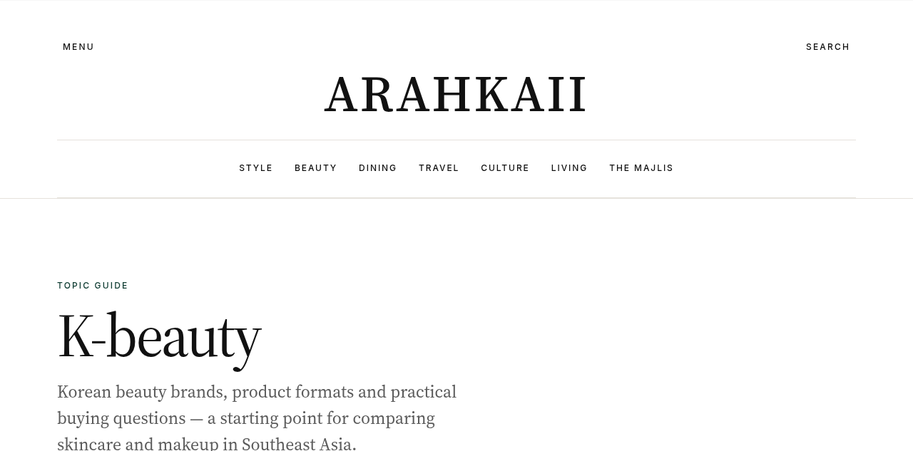
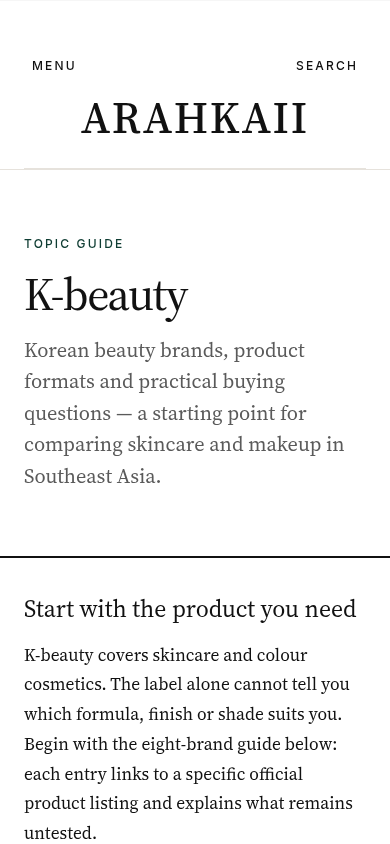
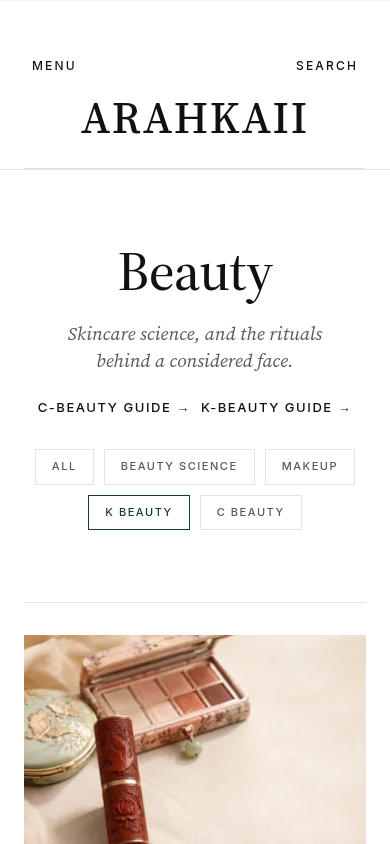

# SEO corrections — 5 October 2026

## Site and scope

This release applies to **www.arahkaii.com**, repository `nicholsmindset/arahkaii_blog`, based on production commit `edf93b25a91c08ac84fcc0bd184a8f8a8ea3a140`. The initial request spelled the domain `arahakii.com`; the audit and deployment target are Arahkaii's existing publication.

## Changes

- Rewrite the quiet luxury guide with a practical garment checklist, one attributable market source, clearly hypothetical cost-per-wear arithmetic, a research-method statement and a correction note. Remove unsupported statistics and forecasts. Preserve the URL, author, publication date and original imagery.
- Rewrite the eight-brand K-beauty guide around official product references. Remove unsupported efficacy, suitability, popularity and availability claims. Explain that the article is desk research, with no independent wear testing, and record the correction.
- Add a K-beauty topic hub with editorial context and links from the Beauty category and matching tag archive. Tag archives remain `noindex`; curated topic hubs remain indexable and appear in the sitemap.
- Replace the misleading category “Load more” label with “Explore all latest stories”. All category stories were already present; the destination remains the complete latest feed.
- Keep newsletter signup paused, as the owner requested. Offer the working RSS feed alongside the sample edition.
- Inline generated styles to remove blocking CSS requests. Use Source Serif 4's smaller weight-variable files, retaining the family, weights and italics while removing the optical-size axis. Preload the three Latin faces used by the editorial text and navigation. This reduces the normal/italic serif Latin font payload from approximately 253 KB to 103 KB.
- Make the local performance server precompress text assets with Brotli/gzip, consistent with the live Vercel response's compression. The two-second budget and Lighthouse's mobile settings remain unchanged. This is a measurement correction; it does not enable a new production compression setting.

## Verification

- `npm run verify`: all 16 publishing tests pass, Astro diagnostics report no errors or warnings, content and redirects validate, production build succeeds, all 524 JSON-LD blocks validate, and all 115 generated pages pass links, headings, landmarks, image and sitemap checks.
- Focused Chromium checks: K-beauty topic hub on desktop and mobile; Beauty tag filtering, guide links and destination label; both corrected articles; homepage. No horizontal overflow or browser errors observed. Check the PR for final performance measurements and production deployment evidence.
- Live robots.txt permits search crawlers and declares the sitemap index. Canonical and robots directives were checked in the generated pages.

### Browser evidence

## Remaining work outside this release

- Search Console is needed to verify Google's actual indexing, query performance, manual actions and field Core Web Vitals. A build audit cannot establish those outcomes or guarantee rankings.
- The Ahrefs audit snapshot (4 October 2026) showed very limited organic visibility and a sample of suspicious referring domains. A suspicious backlink sample does not establish a penalty. Review link history and Search Console before considering removal outreach or a disavow file; no disavow is submitted by this release.
- Newsletter provider credentials remain absent and signup is intentionally paused. The owner selected “Keep signup paused for now”.

## Rollback

Revert the merged SEO release commit through the repository, or promote the previously verified Vercel production deployment `dpl_4BzcWnjexCD6Thy32UqHoTEzHDvp`. No database migrations or external content writes are involved.
