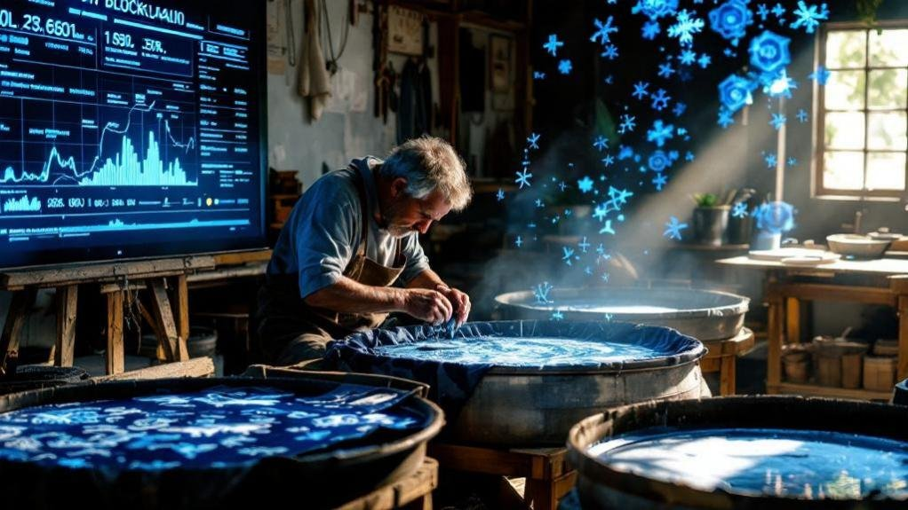

The intersection of batik, blockchain, and Indonesia represents one of the most innovative approaches to preserving cultural heritage through technology. In 2009, UNESCO inscribed Indonesian batik as a Masterpiece of the Oral and Intangible Heritage of Humanity. It was meant to be a triumph—global recognition of a craft refined over centuries, a source of national pride, a protection against cultural erasure.

Instead, something unexpected happened. The very prestige that should have protected Indonesia's treasured textile attracted counterfeiters. Within years, Chinese manufacturers flooded Southeast Asian markets with machine-printed imitations, undercutting genuine artisans and confusing consumers about what constitutes real batik. The UNESCO seal, intended as a shield, had inadvertently painted a target.

Fifteen years later, Indonesia's batik industry finds itself at a crossroads. Export figures are surging—Q1 2025 saw US$7.63 million in batik exports, a 76.2% increase from the previous year. Young Indonesians are embracing batik as identity rather than obligation, wearing it to universities and concerts rather than reserving it for weddings. But beneath this renaissance lies a crisis of authenticity that threatens the craft's soul. And the solutions emerging—from blockchain verification to AI-assisted natural dye databases—are as unexpected as the problem itself.

* * *

## Batik, Blockchain, and Indonesia: The Counterfeit Crisis Nobody Solved

The numbers are stark. Indonesia has approximately 20,000 batik entrepreneurs. Fewer than 1,000—less than five percent—have adopted the Batik Mark Indonesia label, the government's authenticity certification programme designed to distinguish genuine Indonesian batik from imitations.

This isn't apathy. It's economics. The certification process requires documentation, inspection, and ongoing compliance that small artisan workshops struggle to maintain. Meanwhile, counterfeit producers face no such burdens. They replicate popular patterns digitally, print them on fabric in industrial quantities, and sell at prices genuine hand-drawn batik cannot match.

The consumer, standing in a market stall or scrolling an e-commerce platform, often cannot tell the difference. Traditional batik tulis (hand-drawn) takes weeks to complete; a single cloth might require forty hours of wax application and dyeing. Machine-printed imitations replicate the visual pattern in minutes. The prices reflect this disparity—but so does the cultural value embedded in each piece. When consumers unknowingly purchase counterfeits, they're not just losing money; they're inadvertently defunding the artisans who maintain living tradition.

Legislative efforts have struggled to keep pace. Intellectual property frameworks designed for industrial patents adapt poorly to communal cultural heritage. Who owns a pattern developed across generations in a Javanese village? How do you prosecute infringement of a design that predates copyright law by centuries? Indonesia's lawmakers are working toward stronger protections, but enforcement remains inconsistent, and the flood of counterfeits continues largely unchecked.

* * *

## The Youth Reclamation

Against this backdrop of authenticity crisis, something unexpected is occurring in Indonesia's cities: batik is becoming cool again.

For decades, batik carried associations with formality and obligation—the fabric of government uniforms, wedding ceremonies, and religious occasions. Young Indonesians wore it because they had to, not because they wanted to. That relationship is inverting.

Contemporary designers are deconstructing batik's formal reputation, integrating traditional patterns into streetwear silhouettes. Batik appears on bomber jackets, casual shirts, and accessories—contexts that would have seemed disrespectful a generation ago but now read as pride rather than irreverence. University students wear batik to lectures. Musicians perform in batik-printed merchandise. Social media amplifies these expressions, creating feedback loops where wearing batik becomes a statement of cultural identity rather than conformity.

This generational shift matters beyond aesthetics. When young Indonesians choose batik voluntarily, they create domestic demand that sustains artisan livelihoods. They become advocates who can distinguish authentic from counterfeit—and who care about the difference. The youth reclamation of batik may prove more effective than legislation in protecting the craft's future.

* * *

## Automation as Ally, Not Enemy

The tension between technology and tradition runs deep in craft industries worldwide. Batik is no exception—but Indonesia's approach offers a model worth examining.

The Batik Pendulum, a drip-method innovation developed for semi-automated wax application, doesn't replace the artisan's hand. It handles repetitive baseline patterns, freeing skilled craftspeople to focus on the intricate detail work that distinguishes exceptional batik from adequate batik. CNC-based automated machines serve similar functions: they accelerate production of foundational elements while preserving human mastery for finishing.

Electric batik stoves have replaced traditional charcoal heating in many workshops, improving temperature consistency while reducing both energy costs and carbon emissions. These aren't headline-grabbing innovations, but they compound: more consistent heat means fewer failed wax applications, which means less material waste, which means artisans can spend time creating rather than correcting.

The principle underlying these adoptions is preservation through adaptation. Technologies that eliminate craft entirely meet resistance; technologies that amplify craft capacity find acceptance. Indonesia's batik industry is learning to distinguish between the two.

* * *

## NADIN: The Database Preserving Centuries of Colour

Perhaps the most elegant technological intervention in contemporary batik production goes largely unnoticed by consumers: the Natural Dyes Indexation system, known as NADIN.

Traditional batik derives its distinctive colours from plant-based dyes—indigo, soga bark, mengkudu roots—developed through generations of experimentation in specific regions. These recipes exist primarily as oral tradition, passed from master to apprentice. When a master artisan dies without successor, their colour knowledge dies with them.

NADIN digitally catalogues these recipes, preserving the precise botanical sources, preparation methods, and application techniques that produce specific hues. The database serves multiple functions: it protects endangered knowledge from disappearing; it enables artisans in one region to access techniques developed elsewhere; and it provides a reference point for authenticating genuinely natural-dyed batik against synthetic imitations.

The project represents cultural preservation through documentation rather than restriction—making traditional knowledge more accessible rather than locking it away. For an industry struggling with authenticity verification, this kind of transparent knowledge-sharing may prove as valuable as certification labels.

* * *

## The Sustainability Advantage

Environmental consciousness is reshaping consumer expectations globally, and batik production—historically dependent on chemical dyes and significant water usage—faces pressure to adapt.

Some Indonesian producers are responding with innovations that transform liabilities into differentiators. Batik ink derived from palm oil waste repurposes an agricultural byproduct that would otherwise contribute to environmental degradation. Liquid waste processing systems capture and treat dyeing effluent before it reaches waterways. Natural dye revival, supported by databases like NADIN, reduces reliance on synthetic chemicals altogether.

These aren't merely defensive measures. Sustainability becomes a marketing advantage when consumers increasingly factor environmental impact into purchasing decisions. Batik producers who can document eco-friendly practices—and verify them through transparent supply chains—command premium positioning in markets where "sustainable fashion" drives purchasing behaviour.

The intersection is strategic: sustainability practices often overlap with authenticity markers. Hand-drawn batik using natural dyes and traditional techniques is inherently more sustainable than mass-produced synthetic alternatives. Emphasising environmental credentials simultaneously emphasises cultural authenticity.

* * *

## Blockchain: From Buzzword to Verification Tool

The word "blockchain" has been attached to countless problems it cannot solve. Batik authentication may be an exception.

The fundamental challenge in combating counterfeit batik is verification: how does a consumer know that the cloth they're purchasing genuinely originated from an Indonesian artisan using traditional techniques? Certification labels help, but labels can be counterfeited too. Documentation helps, but paperwork can be forged.

Blockchain offers something different: an immutable record of provenance that cannot be retroactively altered. When a batik piece enters a blockchain-verified supply chain at point of creation—documented with the artisan's identity, location, techniques used, and materials sourced—that record persists through every subsequent transaction. A consumer scanning a QR code can trace the cloth's journey from workshop to their hands, with each step independently verified.

Several Indonesian initiatives are piloting this approach, integrating blockchain verification with existing ERP (Enterprise Resource Planning) platforms that batik SMEs already use for order management and logistics. The technology doesn't require artisans to become crypto-literate; it operates in the background, adding verification layers to existing workflows.

Challenges remain. Blockchain verification requires initial documentation—and the artisans least equipped to provide it are often those most vulnerable to counterfeiting. Scaling from pilot programmes to industry-wide adoption demands infrastructure investment. And blockchain solves only the supply-chain verification problem; it cannot prevent someone from creating counterfeit batik and selling it outside verified channels.

Still, for consumers who want assurance that their purchase supports genuine Indonesian craftspeople, blockchain-verified batik offers a level of transparency that certification labels alone cannot match. The technology is moving from experimental to practical—and for an industry fighting authenticity crises, practical solutions matter more than perfect ones.

* * *

## The Global Stage

Indonesia's batik industry is no longer merely domestic. Exports reach the United States, Japan, Germany, and across ASEAN. The sector is projected to contribute to a textile industry valued at US$22.4 billion by 2033.

This globalisation creates both opportunity and pressure. International consumers unfamiliar with batik tradition may lack the cultural context to distinguish authentic from counterfeit—making verification technologies even more critical. But global demand also creates economic incentive for authenticity: premium markets pay premium prices for documented provenance.

Digital platforms accelerate this dynamic. Indonesian artisans who once reached only local markets now ship directly to international buyers through e-commerce. Social media showcases their work to audiences who might never visit a Javanese workshop. The intermediaries who traditionally controlled access—wholesalers, exporters, retail buyers—find their gatekeeping power diminished as producers connect directly with consumers.

For young designers blending batik with contemporary fashion, global platforms offer immediate distribution. A batik-streetwear fusion piece can trend on Instagram, sell through a designer's website, and ship worldwide within a single week. This velocity of cultural transmission would have been unimaginable a generation ago.

* * *

## Heritage as Living Practice

The batik industry's challenges—counterfeiting, authentication, sustainability, globalisation—are not unique to Indonesia. Craft traditions worldwide face similar pressures. What makes batik's response worth watching is the integration of solutions: technology serving tradition, youth reclaiming heritage, sustainability reinforcing authenticity.

This is not a simple story of ancient craft versus modern threat. It's more complicated and more hopeful: traditional knowledge adapting to contemporary conditions, finding new expressions and new protections while maintaining cultural continuity.

Batik has survived colonial suppression, industrial disruption, and globalised competition. It emerged from each challenge transformed but intact. The current crisis—counterfeiting enabled by digital reproduction, complicated by e-commerce distribution—is severe. But the responses emerging from Indonesia's workshops, tech hubs, and design studios suggest that batik will survive this too. For further reading, see [UNESCO Intangible Heritage](https://ich.unesco.org/en/RL/indonesian-batik-00170).

The cloth your grandparents wore to ceremonies carries different meaning when your generation wears it to concerts. The wax patterns applied by hand for forty hours gain new significance when blockchain verification proves their authenticity. The natural dyes catalogued in digital databases preserve knowledge that might otherwise disappear forever.

Tradition and technology. Heritage and innovation. Batik's paradox is that embracing both may be the only way to preserve either.

### Related Reading

- [Jakarta Fashion Week 2025](https://www.arahkaii.com/jakarta-fashion-week-2025/)
- [The Rise of Modest Streetwear in Southeast Asia](https://www.arahkaii.com/modest-fashion-streetwear-southeast-asia-muslim-fashion-2025/)
- [Inside SukkhaCitta's Radical Reinvention of Fashion](https://www.arahkaii.com/sukkhacitta-regenerative-fashion-indonesia-artisan-economics/)

### Read next

- [Covered and Cool](https://www.arahkaii.com/fashion/modest-fashion-streetwear-southeast-asia-muslim-fashion-2025/)
- [The $2.3 Million Jeans](https://www.arahkaii.com/fashion/kendrick-lamar-super-bowl-jeans-2-3-million-media-value/)
- [Why Quiet Luxury Is Fashion’s Biggest Contradiction](https://www.arahkaii.com/fashion/why-quiet-luxury-is-fashion-biggest-contradiction/)
- [Kering Reports 15% Revenue Decline as Gucci Struggles With Brand Repositioning](https://www.arahkaii.com/fashion/kering-reports-revenue-decline-gucci-struggles/)
