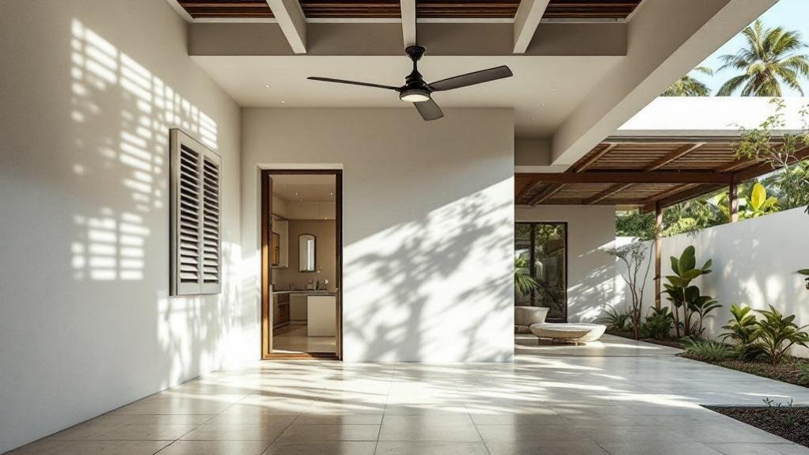

Home cooling in tropical Southeast Asia is more than a comfort question—it’s an energy crisis, a design challenge, and a cultural negotiation all at once. There's a thermostat battle happening in homes across Southeast Asia. One person wants 22°C. Another insists 24°C is cold enough. Someone else quietly bumps it to 20°C when no one's looking. The electricity bill arrives, and everyone blames everyone else.

This domestic cold war reflects a deeper misunderstanding about how cooling actually works—and what thermal comfort genuinely requires. The science suggests most of us are overcooling our homes, spending significantly more than necessary while often feeling less comfortable than we could. Understanding why reveals opportunities that go beyond simply adjusting a thermostat.

* * *

## Home Cooling in Tropical Southeast Asia: The Cooling Paradox

Southeast Asia's relationship with air conditioning is complicated. In Singapore, air conditioning accounts for approximately 40% of household electricity consumption. Across the region, residential cooling demand has grown faster than any other energy category over the past two decades. The hotter it gets, the more we cool. The more we cool, the more waste heat our condensers pump into already-warm urban environments. The cycle feeds itself.

Yet the fundamental question rarely gets asked: what temperature do we actually need?

Research consistently demonstrates that thermal comfort depends on more than air temperature alone. Air movement, humidity, radiant heat from surrounding surfaces, clothing, and activity level all contribute to how warm or cool we feel. Two rooms at identical thermostat settings can feel dramatically different depending on these factors.

This is why the hybrid cooling approach—pairing air conditioning with ceiling fans—delivers outsized results. Studies in tropical buildings show energy reductions of up to 32% while maintaining equivalent comfort levels. The mechanism is straightforward: moving air accelerates heat dissipation from skin, making higher temperatures feel cooler. A room at 26.5°C with ceiling fans circulating air feels as comfortable as a still room at 24°C—but consumes significantly less energy to maintain.

The implications extend beyond individual bills. If every household in Singapore raised their thermostat by 2°C while adding air movement, the aggregate reduction in electricity demand would equal the output of a small power station.

* * *

## The Building as Climate Machine

Before mechanical air conditioning existed, tropical architecture evolved sophisticated strategies for managing heat. These passive design principles haven't become obsolete—they've become undervalued.

**Orientation and shading** determine how much solar heat a building absorbs before cooling systems engage. In the tropics, east and west facades receive the most intense sun exposure. Deep overhangs, external louvers, and strategic tree placement can reduce cooling loads by 20-30% simply by preventing heat from entering in the first place. Shading is always more efficient than cooling: blocking a unit of heat costs nothing, while removing it requires energy.

**Thermal mass** describes materials that absorb heat slowly and release it gradually. Concrete, tile, and masonry store daytime warmth and radiate it during cooler nights. In well-designed buildings, this thermal buffering smooths temperature swings, reducing the intensity of cooling required during peak hours. The principle explains why traditional shophouses with thick masonry walls often feel cooler than modern lightweight constructions, even without air conditioning.

**Natural ventilation** exploits pressure differences created by wind and temperature variation to move air through spaces. Cross-ventilation—openings on opposite sides of a room—allows breezes to flow continuously. Stack ventilation uses the tendency of warm air to rise, drawing cooler air in at lower levels as heated air exits through high openings. These strategies work best when buildings are designed around them; retrofitting ventilation into spaces conceived for sealed, air-conditioned operation is significantly harder.

**Surface-to-volume ratio** influences how much heat a building exchanges with its environment. Compact forms with lower ratios require less cooling than sprawling layouts with extensive exterior surfaces. Research shows ratios ranging from 0.19 to 0.47 across typical buildings, with corresponding cooling loads varying from 43 to 57 kWh per square metre annually. The shape of your home affects your energy bills more than most residents realise.

* * *

## The Comfort Zone Is Wider Than You Think

Thermal comfort research challenges assumptions about what temperatures we can tolerate. The ASHRAE Standard 55, used internationally for building design, identifies a comfort zone spanning 23°C to 28°C under appropriate conditions. Singapore's Building and Construction Authority recommends 25°C as a reasonable cooling setpoint—yet many households maintain temperatures well below this.

The gap between recommended and actual settings reflects psychology as much as physiology. We've been conditioned to associate intense cold with premium cooling. Shopping malls blast arctic air. Offices run refrigerator-cold year-round. Visitors from temperate climates assume we're compensating for outdoor heat when we're actually overshooting optimal comfort.

Acclimatisation matters. Residents who gradually adjust to higher indoor temperatures report satisfaction at settings that would initially feel warm. The body adapts. What feels uncomfortable in week one feels normal in week four. This adaptation potential suggests that comfort zones are partially learned rather than fixed—and that relearning is possible.

| Setpoint | Energy vs 24°C Baseline | Comfort Rating | Strategy |
| --- | --- | --- | --- |
| 24°C | Baseline | High | Standard practice |
| 25°C | \-10 to 15% | High | Minor adjustment |
| 26°C | \-20 to 25% | Good with air movement | Add ceiling fans |
| 26.5°C | \-30 to 32% | Maintained | Hybrid cooling optimal |
| 28°C | \-40%+ | Acceptable for many | Natural ventilation viable |

The table reveals a non-linear relationship: each degree of thermostat increase saves proportionally more energy. The jump from 24°C to 25°C saves less than the jump from 26°C to 27°C. This means the highest-impact changes occur above typical comfort expectations—precisely where resistance to adjustment is strongest.

* * *

## Practical Implementation

Theory becomes useful when it translates to action. For households seeking to reduce cooling costs without sacrificing comfort, the following approaches offer graduated entry points.

**Start with air movement.** Ceiling fans consume approximately 75 watts; air conditioners consume 1,000-3,000 watts depending on capacity and efficiency rating. Running fans allows higher thermostat settings that more than offset the additional fan consumption. If your home lacks ceiling fans, portable or wall-mounted fans provide similar benefits. The key is directing airflow toward occupied areas rather than simply stirring room air.

**Audit your solar gains.** Walk through your home during afternoon hours and identify which surfaces feel warm to touch. These are absorbing solar radiation that your air conditioner must subsequently remove. External shading—awnings, blinds on the outside of windows, shade cloths—costs far less than the cooling energy they prevent. Internal blinds help but less effectively: by the time sunlight has passed through glass, most heat has already entered.

**Seal and insulate selectively.** Air-conditioned spaces benefit from reduced infiltration—closing gaps around doors and windows that allow cooled air to escape and warm air to enter. Ceiling insulation reduces heat gain from roof spaces that can exceed 60°C in direct sun. These improvements compound: better sealing means air conditioners run less frequently, extending equipment lifespan while reducing bills.

**Consider your equipment.** Air conditioner efficiency varies enormously. Singapore's Energy Label System rates units from 1 to 5 ticks, with 5-tick units using roughly 40% less energy than 1-tick units for equivalent cooling. When replacing equipment, the efficiency premium typically pays back within two to three years through reduced electricity costs. Inverter technology, which modulates compressor speed rather than cycling on and off, offers additional savings of 20-30% compared to fixed-speed units.

**Embrace scheduling.** Pre-cooling spaces before occupancy—running air conditioning during afternoon hours when you're away, then maintaining temperature during evening presence—can reduce overall consumption compared to cooling from scratch. Timer functions and smart thermostats automate this approach. The strategy works because maintaining temperature requires less energy than achieving it.

* * *

## The Urban Heat Island Problem

Individual household decisions aggregate into city-scale consequences. Air conditioning doesn't eliminate heat; it moves heat from indoor to outdoor spaces. Every condenser unit exhausts warm air into the surrounding environment. In dense urban areas, this waste heat accumulates, raising ambient temperatures and requiring neighbouring units to work harder.

Singapore's Urban Heat Island effect adds 4-7°C to central business district temperatures compared to rural areas. This temperature premium translates directly to increased cooling demand: hotter outdoor air means greater temperature differential for air conditioners to overcome.

The feedback loop is troubling. More cooling creates hotter cities that require more cooling. Breaking this cycle requires systemic interventions—urban greenery, reflective surfaces, district cooling systems—alongside individual efficiency improvements. But household choices contribute to the problem or the solution. Efficient cooling reduces waste heat. Passive design strategies require no heat rejection at all.

* * *

## The Comfort Reframe

The question "what temperature do you need?" deserves more consideration than it typically receives. For many households, the honest answer is: cooler than optimal, because we've conflated intense cold with effective cooling.

Reframing comfort as a range rather than a point—and recognising that air movement, humidity control, and acclimatisation all contribute—opens possibilities that pure temperature chasing forecloses. The 26.5°C household with ceiling fans enjoys equivalent comfort to the 24°C household without them, while spending roughly a third less on electricity. Over a year, that difference funds other priorities. For further reading, see [Energy Star](https://www.energystar.gov).

Climate change projections suggest cooling demand will intensify across Southeast Asia. Rising temperatures and more frequent heat events will pressure grids and budgets alike. The households that have already optimised their cooling approach—through building improvements, efficient equipment, and realistic temperature expectations—will navigate this future more comfortably than those still fighting the thermostat war.

The ceasefire starts with understanding what comfort actually requires. For most of us, it's less than we're currently paying for.

### Continue Reading

- [Southeast Asian lifestyle](/southeast-asian-cities-digital-nomad-luxury-lifestyle-2/)
- [sustainable living](/the-conscious-luxury-manifesto-sustainable-living/)

### Read next

- [The Conscious Luxury Manifesto](https://www.arahkaii.com/living/the-conscious-luxury-manifesto-sustainable-living/)
- [Covered and Cool](https://www.arahkaii.com/fashion/modest-fashion-streetwear-southeast-asia-muslim-fashion-2025/)
- [Jakarta Fashion Week 2025](https://www.arahkaii.com/fashion/jakarta-fashion-week-2025/)
- [The Ultimate Guide to Finding the Perfect Foundation Shade for Southeast Asian](https://www.arahkaii.com/beauty/the-ultimate-guide-to-finding-the-perfect-foundation-shade-for-southeast-asian-skin-tones/)
