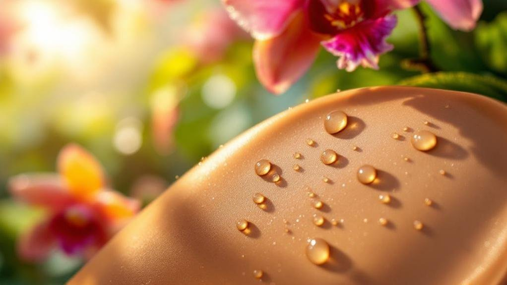
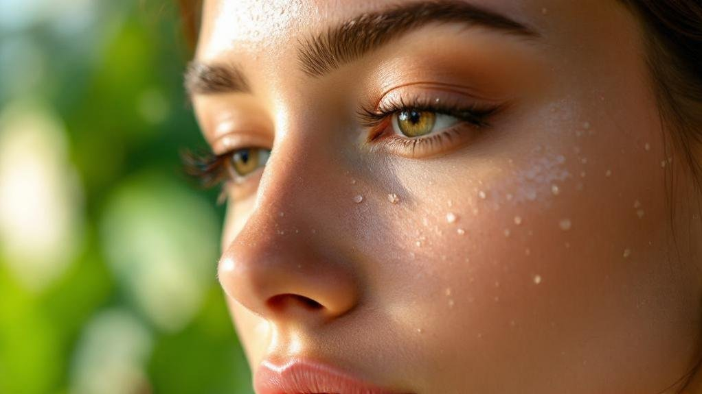
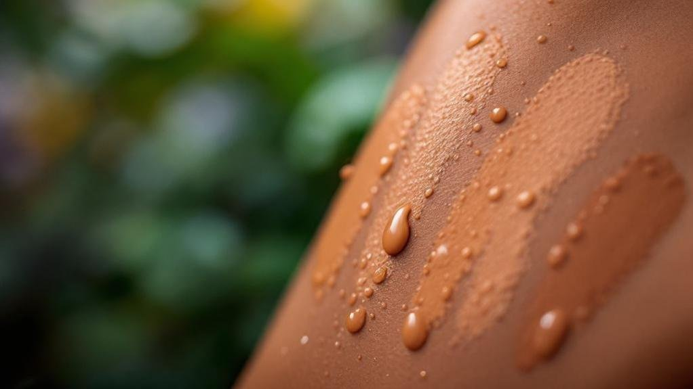

Finding humidity resistant makeup that survives tropical heat requires understanding the science behind why conventional formulas fail in Southeast Asian climates. There's a moment every Southeast Asian makeup wearer knows intimately: you leave the house looking polished, and by noon, your foundation has migrated, your concealer has creased, and your lipstick exists only as a faint memory on your coffee cup. You're not imagining it. Your makeup genuinely isn't designed for where you live.

The global beauty industry formulates for temperate climates—environments where humidity hovers around forty percent and temperatures rarely breach thirty degrees. Singapore averages eighty-four percent humidity. Bangkok hits ninety percent in monsoon season. These aren't edge cases your foundation was stress-tested for; they're the conditions you navigate daily.

But understanding _why_ makeup fails in tropical heat reveals exactly what to look for in products that won't.

* * *

## The Science of Meltdown

Makeup failure in humidity isn't random—it's chemistry. Three forces work against your face simultaneously.

**Sebum acceleration.** Heat triggers increased oil production. Your skin, attempting to cool itself, pushes sebum to the surface faster than in cooler climates. This oil disrupts the bond between makeup and skin, causing foundation to slide and separate. The effect compounds: more heat means more oil means faster breakdown.

**Moisture infiltration.** Humidity introduces water vapour that penetrates makeup films from the outside. Traditional formulations—designed to sit on skin's surface—aren't engineered to resist external moisture. Water molecules work their way between pigment particles and skin, lifting product away from where you applied it.

**Oxidative stress.** Intense UV exposure, combined with pollution particles that adhere to sweat, accelerates oxidation. This is why foundation doesn't just disappear—it often changes colour first, turning orange or grey before vanishing entirely. The iron oxides in most formulations react with environmental stressors, shifting undertones throughout the day.

Understanding these mechanisms transforms how you evaluate products. You're not looking for "long-wear" marketing claims; you're looking for specific formulation strategies that address each failure point.

* * *

## Humidity Resistant Makeup That Actually Works: Formulation Strategies

The technology behind humidity-resistant makeup has evolved significantly, though marketing rarely explains the mechanisms clearly. Here's what the terminology actually means.

### Film-Forming Polymers

Effective tropical-proof makeup creates a flexible, breathable barrier rather than sitting directly on skin. Look for ingredients like VP/VA copolymer, acrylates copolymer, or dimethicone crosspolymer. These create mesh-like films that allow moisture to escape (preventing that suffocated feeling) while blocking external humidity from penetrating.

The key distinction: this film should be _on_ your makeup, not between your makeup and your skin. Products that prime with heavy silicones often trap sebum underneath, accelerating breakdown rather than preventing it.

### Sebum-Responsive Technology

Advanced formulations now include polymers that react to oil production—absorbing excess sebum without over-mattifying. Silica microspheres and oil-absorbing powders suspended in lightweight bases accomplish this better than traditional mattifying primers, which often cake as they absorb oil throughout the day.

The texture indicator: products should feel weightless on application. If a "humidity-proof" foundation feels heavy or mask-like, it's likely relying on occlusion (blocking) rather than intelligent oil management.

### Water-Resistant vs. Waterproof

These terms aren't interchangeable. Water-resistant formulations withstand moisture and light sweat—suitable for daily humidity exposure. Waterproof formulations resist immersion and heavy perspiration but often require oil-based removers and can stress skin with daily use. For tropical living, water-resistant with good film-forming technology typically outperforms waterproof in terms of comfort and skin health.

* * *

## The Undertone Factor in Tropical Light

Colour matching in Southeast Asia presents a distinct challenge beyond humidity. Tropical light—intense, direct, and often harsh—reveals undertones that softer northern light obscures.

A foundation that appears perfectly matched in an air-conditioned store can read completely different in outdoor tropical sunlight. Warm undertones intensify. Cool undertones can appear ashy. This is why the standard "test on your jawline" advice, typically given in temperate-climate beauty counters, often fails here.

The solution: always final-test shades in natural outdoor light, not just store lighting. And when selecting colours for lips and cheeks, lean toward tones that complement rather than contrast your undertones. In tropical light's unforgiving brightness, harmony reads as polished; contrast reads as jarring.

Warm undertones (common across Southeast Asian skin) pair naturally with coral, peach, and bronze. Neutral undertones offer more flexibility but still benefit from avoiding extremes. Cool undertones—less common but present—suit rose and berry tones. Olive undertones, prevalent across the region, require particular care: avoid anything too pink or too orange, seeking neutral-warm midpoints instead.

* * *

## Ingredient Intelligence: What to Seek and Avoid

Beyond texture and colour, specific ingredients determine whether makeup supports or stresses tropical skin.

| Ingredient Category | What It Does | Why It Matters in Tropical Climates |
| --- | --- | --- |
| **Antioxidants** (Vitamin C, E, Niacinamide) | Neutralise free radicals from UV and pollution | Prevents the oxidative colour-shift that turns foundation orange by afternoon |
| **Broad-spectrum SPF** | Blocks UVA/UVB radiation | Essential—tropical UV intensity is 2-3x higher than temperate zones |
| **Hyaluronic acid** (lightweight forms) | Hydrates without heaviness | Prevents the dehydration-then-oil-surge cycle that destabilises makeup |
| **Zinc oxide / Titanium dioxide** | Physical sun filters | More stable in heat than chemical filters, less likely to degrade |

**Ingredients to approach cautiously:**

Heavy silicones (dimethicone in high concentrations) can trap heat and sebum. Petroleum-based occlusives feel suffocating in humidity. Alcohol denat in high amounts temporarily mattifies but triggers rebound oil production. Fragrance, while not performance-related, can irritate heat-sensitised skin.

* * *

## The Texture Revolution

Consumer demand is reshaping what brands formulate for tropical markets—and the shift reveals what actually performs.

The movement away from heavy, full-coverage foundations toward lightweight, buildable textures isn't merely aesthetic preference. It's functional. Thinner formulations with flexible films maintain adhesion better than thick, mask-like coverage. They move with skin rather than cracking. They allow heat to dissipate rather than trapping it against your face.

Similarly, the rise of skin tints, cushion compacts, and serum foundations in Asian beauty markets reflects climate-driven innovation. These formats emerged in Korea and Japan—both humid climates—precisely because traditional Western foundations underperformed there.

Powder products, once dismissed as drying, are experiencing rehabilitation when formulated correctly. Finely-milled, oil-absorbing powders that don't cake offer genuine humidity resistance. The key is application: light dustings throughout the day, rather than heavy initial application.

* * *

## Making It Last: Application Strategy

Even the most sophisticated formulation fails without proper application technique for tropical conditions.

**Prep for porosity.** Lightweight, fast-absorbing moisturisers outperform rich creams. Wait five to ten minutes after skincare before applying makeup—rushing this step is the single most common cause of midday meltdown.

**Prime strategically.** Use mattifying primers only on the T-zone; hydrating primers on cheeks and perimeter. One primer everywhere creates problems somewhere.

**Build thin layers.** Two sheer layers of foundation outperform one heavy layer. Each layer has opportunity to bond; thick single applications simply slide.

**Set selectively.** Powder the areas that produce oil; leave other areas with a skin-like finish. Over-powdering the entire face creates a canvas that cracks rather than flexes.

**Mist, don't spray.** Setting sprays work—but hold the bottle at arm's length for fine mist rather than close-range droplets that disturb your makeup.

* * *

## The New Standard

Tropical-proof beauty isn't about finding products that _survive_ your climate. It's about finding formulations designed to thrive in it.

This requires abandoning the assumption that global bestsellers will perform globally. It means reading ingredient lists rather than marketing claims. It means understanding that the chemistry working against your makeup is predictable—and therefore defeatable with the right approach. For further reading, see [American Academy of Dermatology](https://www.aad.org).

Southeast Asia's beauty market is increasingly driving innovation rather than receiving hand-me-down formulations from temperate-climate laboratories. Korean cushion technology, Japanese sebum-control advances, and emerging Southeast Asian brands understand these conditions intimately.

Your makeup can last. The science is there. The products exist. It's simply a matter of knowing what to look for—and refusing to settle for formulations that weren't designed for the climate you actually live in.

### Related Reading

- [The Southeast Asian Foundation Guide](https://www.arahkaii.com/the-ultimate-guide-to-finding-the-perfect-foundation-shade-for-southeast-asian-skin-tones/)
- [Why Your Summer Makeup Suddenly Feels Wrong](https://www.arahkaii.com/seasonal-makeup-transition-summer-autumn-colors/)
- [Best Chinese Makeup Brands 2026](https://www.arahkaii.com/beauty-best-chinese-makeup-brands/)

### Read next

- [The Warmth Question](https://www.arahkaii.com/beauty/seasonal-makeup-transition-summer-autumn-colors/)
- [Best Chinese Makeup Brands 2026: Judydoll, Florasis & C-Beauty Worth Buying](https://www.arahkaii.com/beauty/beauty-best-chinese-makeup-brands/)
- [The Ultimate Guide to Finding the Perfect Foundation Shade for Southeast Asian](https://www.arahkaii.com/beauty/the-ultimate-guide-to-finding-the-perfect-foundation-shade-for-southeast-asian-skin-tones/)
- [K-Beauty Broke the Algorithm: How Korea Took Over Your Skincare Routine](https://www.arahkaii.com/beauty/k-beauty-broke-the-algorithm/)
