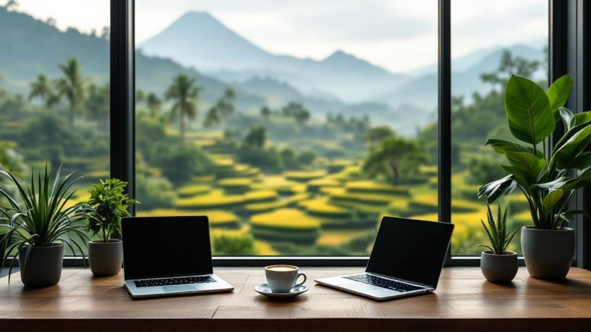
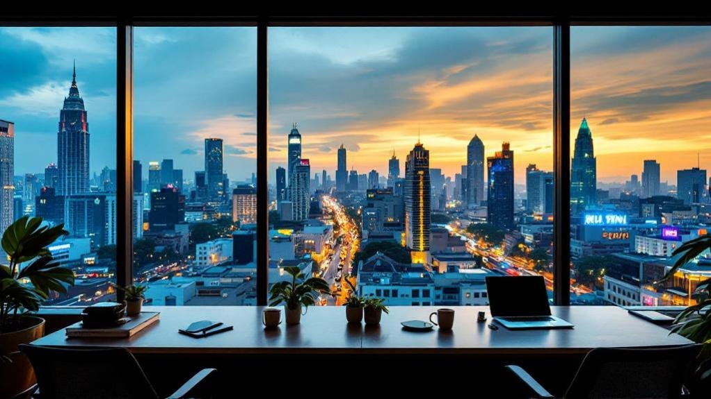
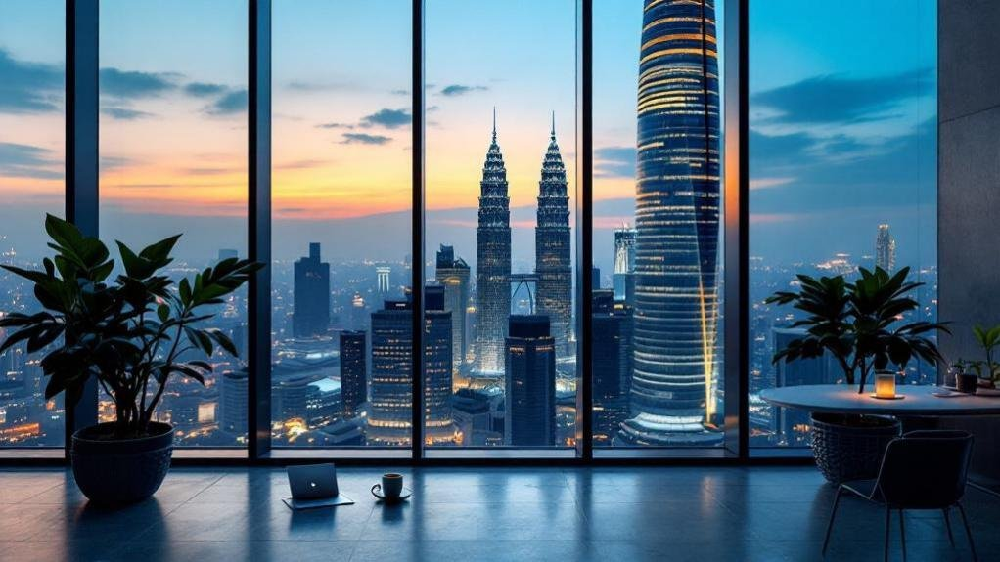
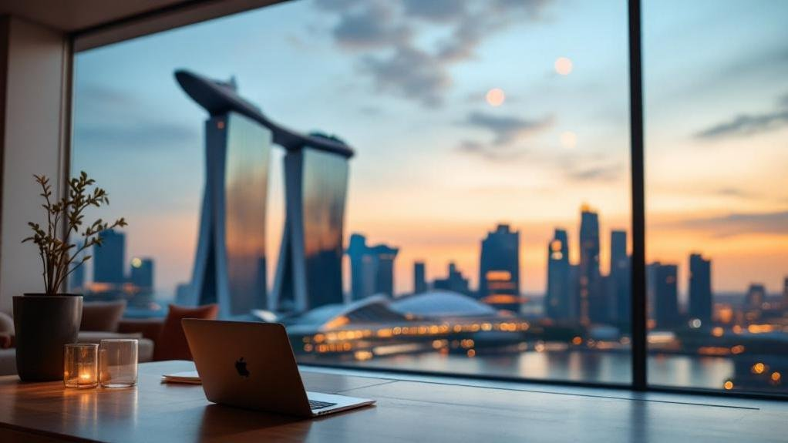

Choosing between the best digital nomad cities in Southeast Asia comes down to cost, community, connectivity, and lifestyle. From Chiang Mai’s legendary affordability to Singapore’s cutting-edge infrastructure, these five cities offer everything remote workers need to thrive in the tropics. For the latest city rankings, visit [Nomad List](https://nomadlist.com).

## Digital Nomad Southeast Asia: Chiang Mai Leads in Affordability

Why do so many digital nomads choose Chiang Mai as their home base? The answer lies in its unbeatable combination of affordable housing and a tight creative community.

You'll find one-bedroom apartments renting for just $300–$500 monthly in trendy neighborhoods like Nimmanahaeminda and Old Town. That leaves you money for exploring what really matters.

Beyond affordability, Chiang Mai delivers modern convenience you'd expect from a thriving digital hub. High-speed internet runs reliably throughout the city, while coworking spaces like Punspace keep you productive. You're never short on options here.

The real magic happens through community events. Regular networking gatherings connect you with fellow nomads, creating friendships and collaboration opportunities.

Plus, dining and transportation won't drain your budget. You get the best of both worlds: low costs and genuine connection.

## Bali: Where Tropical Paradise Embraces Digital Innovation

As you trade mountain views for beachside living, Bali emerges as a destination where you'll find tropical beauty seamlessly blended with the digital infrastructure you need. This Indonesian island transforms work into an experience that nourishes both productivity and well-being.

Your options for workspace and lifestyle include:

1. Tropical coworking spaces like Dojo Bali and Hubud, where you'll work surrounded by lush gardens and creative energy.
2. Wellness retreats integrated into accommodations, helping you balance deadlines with yoga and meditation.
3. Creative neighborhoods in Canggu, Ubud, and Uluwatu offering one-bedroom rentals from $400–$800 monthly.

You'll discover reliable high-speed internet throughout urban areas, affordable dining that fuels your day, and a thriving nomad community ready to welcome you.

Bali doesn't ask you to choose between work and paradise—it offers both.

## Ho Chi Minh City: Vibrant Urban Living for Remote Workers

When you're seeking a destination that pulses with energy, culture, and affordability, Ho Chi Minh City delivers on all fronts.

You'll find one-bedroom apartments in central districts for $400–$700 monthly, leaving your budget comfortable for exploration.

The city's remote workspaces are plentiful. Saigon Coworking and The Factory offer reliable internet and professional environments where you'll connect with fellow digital nomads.

Beyond these offices, affordable cafes scattered throughout provide excellent working spots.

You'll experience authentic cultural moments daily. Grab a scooter to navigate bustling streets, visit Ben Thanh Market for fresh produce, or sample street food that costs just dollars.

The growing expat community means you're never alone in building your remote work lifestyle here.

## Kuala Lumpur: Southeast Asia's Tech-Forward Hub

Kuala Lumpur stands out as Southeast Asia's most technologically advanced city, making it ideal for remote workers who value speed and connectivity.

You'll find yourself thriving in this digital innovation hub where modern infrastructure meets affordability.

Here's what makes Kuala Lumpur perfect for you:

1. Coworking Culture – Spaces like WeWork and independent hubs offer networking opportunities, meeting rooms, and reliable Wi-Fi you'll rely on.
2. Apartment Affordability – Rent ranges from $400–$800 monthly, leaving you money for exploring or saving.
3. High-Speed Internet – Widespread access guarantees your video calls and uploads run smoothly.

You'll appreciate the diverse accommodation options and active expat community that welcomes remote workers.

The city's blend of luxury amenities and reasonable costs creates an ideal environment for focused work and genuine connections.

## Singapore: Premium Excellence in a Global City-State

If you're willing to invest in premium comfort and world-class infrastructure, Singapore's your destination.

This city-state delivers excellence across every aspect of digital nomad life. You'll enjoy some of the fastest internet speeds globally, paired with premium coworking spaces like WeWork and The Work Project. Apartments run $2,000–$3,500 monthly, reflecting Singapore's upscale lifestyle.

| Category | Experience | Benefit |
| --- | --- | --- |
| Internet Speed | Among world's fastest | Seamless work and streaming |
| Coworking Spaces | Premium, well-equipped | Professional networking hub |
| Amenities | Luxury services everywhere | Elevated daily comfort |

The multicultural environment welcomes you warmly, offering diverse dining, shopping, and entertainment options. You'll find luxury amenities throughout—high-end restaurants, wellness centers, and cultural attractions. Singapore's strong expat community hosts regular events, making connections effortless. Yes, it costs more than other Southeast Asian cities, but you're investing in unmatched quality and stability.

### Continue Reading

- [conscious luxury lifestyle](/the-conscious-luxury-manifesto-sustainable-living/)
- [tropical living essentials](/energy-efficient-home-cooling-tropical-southeast-asia/)

### Read next

- [The Ultimate Guide to Finding the Perfect Foundation Shade for Southeast Asian](https://www.arahkaii.com/beauty/the-ultimate-guide-to-finding-the-perfect-foundation-shade-for-southeast-asian-skin-tones/)
- [The Conscious Luxury Manifesto](https://www.arahkaii.com/living/the-conscious-luxury-manifesto-sustainable-living/)
- [The 26-Degree Question: Rethinking Home Cooling in Tropical Southeast Asia](https://www.arahkaii.com/living/energy-efficient-home-cooling-tropical-southeast-asia/)
- [Covered and Cool](https://www.arahkaii.com/fashion/modest-fashion-streetwear-southeast-asia-muslim-fashion-2025/)
