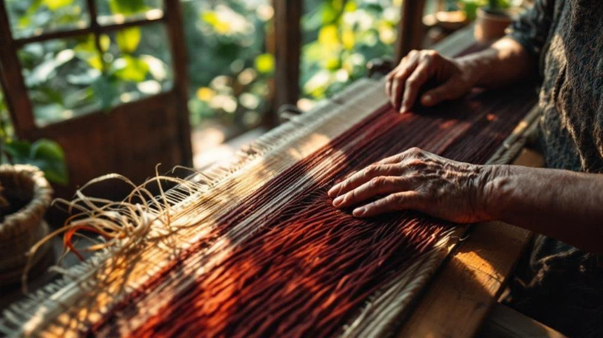
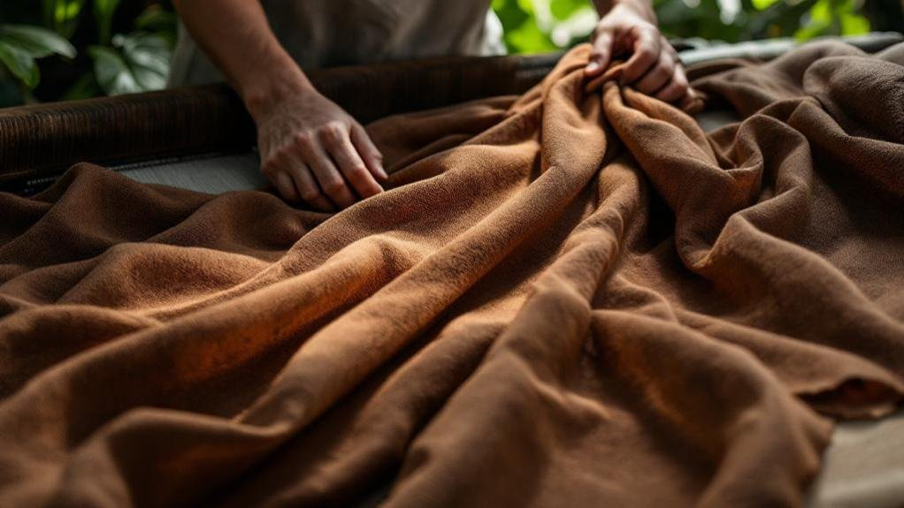

# The Twelve Women in Your Wardrobe: Inside SukkhaCitta's Radical Reinvention of Fashion

SukkhaCitta (also styled SukkhaCijtta) and its regenerative fashion model proves that sustainability and luxury can coexist—if you’re willing to rethink the entire supply chain. _An Indonesian brand is proving that regenerative farming, artisan economics, and luxury quality can coexist—one hand-dyed garment at a time._

* * *

Denica Riadini-Flesch remembers the moment her understanding of fashion shattered. She was in Central Java, visiting the rural communities where her grandmother had grown up, when she encountered women who had spent decades as skilled textile artisans—yet remained trapped in poverty. Their hands created beautiful work. Their families barely survived.

The disconnect haunted her. How could people who possessed such craft mastery remain so economically vulnerable? The answer, she realised, lay not in their skills but in the system surrounding them: a fashion industry designed to extract value from communities rather than build it within them.

SukkhaCitta emerged from that recognition. The brand Riadini-Flesch founded doesn't merely source from Indonesian artisans—it restructures the economic relationships that have historically kept them poor. And in doing so, it's demonstrating something the fashion industry has long claimed impossible: that regenerative practices, fair wages, and commercial viability can coexist.

* * *

## SukkhaCitta and Regenerative Fashion: The Soil Beneath the Shirt

Most sustainable fashion brands begin their story at the factory. SukkhaCitta begins in the field.

The company grows its own cotton using _Tumpang Sari_, an indigenous Indonesian intercropping technique that plants cotton alongside complementary crops—chili, corn, mung beans. This isn't merely organic farming; it's regenerative agriculture designed to restore degraded land rather than simply minimise harm.

The science is straightforward. Monoculture cotton farming depletes soil nutrients, requiring increasing chemical inputs to maintain yields. Intercropping creates biodiversity that naturally controls pests, fixes nitrogen, and builds soil structure. The companion crops provide income during cotton's growing cycle, reducing farmers' financial vulnerability. And the system as a whole sequesters carbon rather than releasing it.

SukkhaCitta's goal—100% regenerative cotton by 2025, with 1,000 hectares of land regenerated by 2030—represents a scale of ambition unusual in sustainable fashion. The brand claims this approach reduces carbon emissions by 90% compared to conventional cotton production. If verified, that figure positions regenerative fashion not as environmental mitigation but as active climate intervention.

The cotton travels from field to finished garment without leaving Indonesia. Natural plant-based dyes replace synthetic chemicals. The entire supply chain—from soil preparation to final stitch—remains visible and documented.

* * *

## The Economics of Twelve Hands

A single SukkhaCitta garment passes through approximately twelve pairs of hands before reaching its owner. This isn't inefficiency; it's design.

The women who create these pieces—called _ibus_, an affectionate Indonesian term—each contribute specialised skills. Some prepare natural dyes from local plants. Others apply the wax-resist patterns of traditional batik. Embroiderers add flora-inspired details. Seamstresses construct the final garments. Each step requires expertise developed over years.

This distributed production model accomplishes something conventional manufacturing cannot: it creates economic value across entire communities rather than concentrating it in single facilities. Over 400 artisans currently work within SukkhaCitta's network, spanning farmers, dyers, and garment makers. The number matters less than the structure: these aren't employees in a factory but participants in an ecosystem designed for their benefit.

The Rumah SukkhaCitta programme extends this logic into education. Vocational training schools operating across seven villages have reached more than 1,500 women, teaching both craft techniques and business fundamentals. The company reinvests profits into these communities, funding schools and supporting families.

The result inverts fashion's typical value extraction. Instead of communities serving the brand, the brand serves communities. Production timelines stretch longer because quality and fairness take precedence over speed. Prices reflect actual labour value rather than racing toward the cheapest possible margin.

* * *

## When Repair Becomes Revolution

The fashion industry's business model depends on obsolescence. Trends cycle faster than fabrics can wear out. Garments become emotionally outdated before they become physically unwearable. Closets fill with clothes that still function but no longer feel current.

SukkhaCitta's circular fashion services directly challenge this logic.

The brand offers repair services for worn garments—not merely its own products but any piece worth preserving. Skilled artisans mend tears, reinforce seams, restore structure. The work requires craft knowledge that fast fashion has largely eliminated: understanding how different fabrics behave, how construction techniques affect longevity, how to extend a garment's life rather than hasten its replacement.

More unusual is the re-dyeing service. Faded garments return to artisans who refresh colours using the same natural plant-based dyes applied to new pieces. A shirt that has lost its vibrancy gains new character. The service transforms the relationship between owner and garment from disposable to durable.

These offerings aren't marginal add-ons. They represent a fundamental business model shift: revenue from extending existing garments rather than solely from selling new ones. The approach requires customers who value longevity over novelty—and creates them by delivering products worth keeping.

* * *

## Heritage Without Costume

Indonesian textile traditions carry deep cultural significance. The kebaya, the kain, the intricate [batik patterns of specific regions](/culture/batik-blockchain-indonesia-textile-authenticity-technology/)—these aren't merely aesthetic choices but connections to ancestry and identity. Yet traditional garments often feel disconnected from contemporary life, relegated to ceremonies and special occasions rather than everyday wardrobes.

SukkhaCitta navigates this tension through translation rather than replication. Traditional techniques—hand-dyeing, wax-resist patterning, embroidery inspired by local flora—apply to silhouettes designed for modern contexts. The garments honour craft heritage without demanding that wearers adopt ceremonial dress for daily life.

The approach requires restraint. It would be easier to simply reproduce traditional forms for international markets eager for "authentic" exoticism. Instead, the brand asks what ancestral techniques can contribute to contemporary garments rather than treating heritage as a finished template to copy.

This distinction matters for cultural preservation. When traditional crafts adapt to current contexts, they remain living practices rather than museum pieces. Artisans develop new applications for inherited skills. Young practitioners see viable futures in textile work. The craft evolves rather than fossilifying.

* * *

## Validation and Velocity

SukkhaCitta's recognition extends beyond niche sustainable fashion circles. The brand holds B-Corp certification—Indonesia's first in the fashion sector. It carries the Nest Seal, becoming the first apparel company to achieve that ethical production verification. Its founder received both the Rolex Award for Enterprise and the Cartier Women's Initiative Award.

These accolades matter not as trophies but as proof points. They demonstrate that external auditors, examining supply chains and production practices and community impact, found substance beneath the sustainability claims. In an industry plagued by greenwashing—where "eco-friendly" often means marginally less harmful rather than genuinely regenerative—third-party verification separates credible actors from marketing exercises.

The commercial viability matters equally. SukkhaCitta operates as a profitable business, not a subsidised charity project. This distinction carries implications for the broader industry: regenerative practices, fair artisan wages, and circular fashion services don't require philanthropic support to survive. They can compete in markets.

Whether the model can scale remains an open question. The labour-intensive production that creates quality and community benefit also constrains volume. Growing beyond current capacity without compromising core principles requires solving challenges that most fashion brands never attempt—because most fashion brands optimise for scale from the start.

* * *

## The Proposition

SukkhaCitta asks something unusual of its customers: patience, investment, and relationship.

Patience because garments take time when twelve artisans contribute their expertise. Investment because fair wages and regenerative farming and circular services cost more than exploitative alternatives. Relationship because the brand invites customers to see their clothing as connection to specific communities rather than anonymous commodities.

This proposition excludes much of the market. Not everyone wants to pay premium prices. Not everyone cares about the hands that made their clothes. Not everyone thinks of garments as companions meant to last decades. For further reading, see [SukkhaCitta Official](https://www.sukkhacitta.com).

But for those who do—and their numbers are growing—SukkhaCitta offers something increasingly rare: fashion that creates more value than it extracts. It is the working proof behind [the conscious-luxury argument](/living/the-conscious-luxury-manifesto-sustainable-living/) — that restraint and provenance can be the premium, not the compromise. Soil regenerated rather than depleted. Artisans enriched rather than exploited. Garments designed for repair rather than replacement.

The twelve women whose hands shaped your shirt remain invisible in conventional fashion. SukkhaCitta makes them visible—and in doing so, reveals what the industry could become if it chose different priorities.

### Related reading

- [The batik authenticity paradox](/culture/batik-blockchain-indonesia-textile-authenticity-technology/)
- [On the Jakarta Fashion Week 2025 runways](/style/jakarta-fashion-week-2025/)
- [The rise of modest streetwear in Southeast Asia](/style/modest-fashion-streetwear-southeast-asia-muslim-fashion-2025/)

### Read next

- [The conscious-luxury manifesto](/living/the-conscious-luxury-manifesto-sustainable-living/)
- [Why Kendrick Lamar's jeans were worth millions](/culture/kendrick-lamar-super-bowl-jeans-2-3-million-media-value/)
