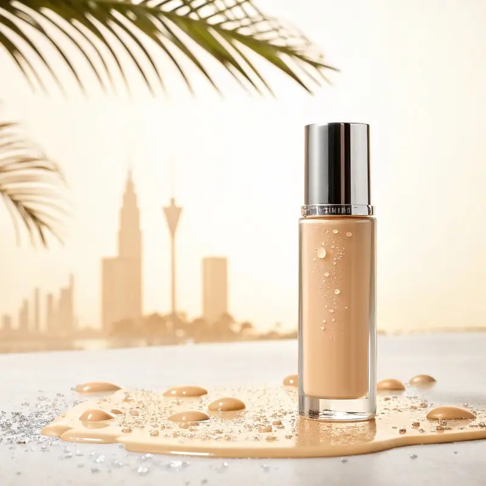

Finding the right foundation shade for Southeast Asian skin tones requires navigating a beauty industry that still hasn’t caught up with the region’s incredible diversity. Finding the perfect foundation shade shouldn’t feel like solving a cryptographic puzzle. Yet for many of us in Southeast Asia, it does. We walk into beauty counters armed with hope and walk out with foundations that oxidise three shades darker, turn grey on our olive undertones, or simply vanish into an ashy oblivion by lunchtime.

Here’s the uncomfortable truth: the global beauty industry has historically designed shade ranges with Western skin tones in mind. Asian complexions—with our diverse spectrum of warm, cool, neutral, and olive undertones—have been left to make do with whatever comes close. Add tropical humidity into the equation, and foundation shopping becomes an exercise in frustration.

But it doesn’t have to be this way. This guide breaks down everything you need to know: the science of undertones, the oxidation problem nobody warns you about, and the techniques that actually work in our climate. Whether you’re fair with pink undertones, medium with golden olive skin, or deep with warm mahogany tones, consider this your definitive resource.

* * *

## Foundation Shades for Southeast Asian Skin: The Diversity We Don’t Talk About

Southeast Asian skin tones span an extraordinary range—from the fairest porcelain found in northern regions to deep, rich browns across the archipelagos. We’re Singaporean Chinese, Malay, Indian, Filipino, Indonesian, Thai, Vietnamese, and countless mixed-heritage individuals, each with distinct colouring. The biggest mistake brands make is treating ‘Asian skin’ as one category.

Consider the spectrum: fair tones (Fitzpatrick I-II) often feature pink, neutral, or cool undertones, common among East Asians. These tones struggle with foundations that pull too yellow or peachy. Light-medium tones (Fitzpatrick II-III)—the most common range in Singapore—span yellow, golden, and olive undertones, where subtle differences dramatically affect how foundation appears. Medium tones (Fitzpatrick III-IV), prevalent across Malay and Indian communities, feature golden, olive, and warm undertones that need foundations resistant to greying. And medium-deep to deep tones (Fitzpatrick IV-VI), historically underserved, are finally receiving the attention they deserve from major brands.

What unites us isn’t our shade—it’s our climate. That tropical humidity makes foundation wear uniquely challenging, and understanding this is half the battle — the same battle explored in our guide to [why makeup melts in tropical heat](/beauty/humidity-resistant-makeup-science-tropical-climate/).

* * *

## Undertones: The Four Categories That Matter

Your undertone is the subtle hue beneath your skin’s surface that remains constant regardless of sun exposure or seasonal changes. Understanding yours is the non-negotiable first step to foundation success.

### Warm Undertones

Warm undertones appear golden, peachy, or yellow-based. If gold jewellery flatters you more than silver, and your veins appear greenish, you likely fall here. This is common across most Southeast Asians, particularly among Malay and Indonesian communities. Look for foundation descriptions including ‘golden,’ ‘warm beige,’ ‘honey,’ or ‘caramel.’ Fenty Beauty’s warm range and MAC’s NC (which stands for ‘neutral cool’ but is actually warm—confusing, we know) excel here.

### Cool Undertones

Cool undertones lean pink, red, or blue-based. Silver jewellery likely suits you better, and your veins appear bluish or purple. This is common among fair-skinned East Asians and some Chinese-Singaporeans. Seek ‘pink,’ ‘rose,’ ‘neutral pink,’ or ‘cool beige’ descriptors. Korean brands like Hera, Sulwhasoo, and Laneige understand cool-toned Asian shades intimately — part of the wider story of [how K-beauty came to define modern complexion](/beauty/k-beauty-broke-the-algorithm/) — as does MAC’s NW range.

### Neutral Undertones

Neutral undertones are the unicorns—a balanced mix of warm and cool that can wear multiple shades successfully. Both gold and silver jewellery probably suit you, and your veins appear blue-green. If this sounds like you, look for ‘neutral,’ ‘beige,’ or ‘natural’ descriptors. Charlotte Tilbury’s middle-range shades and NARS’s Fiji and Punjab work beautifully.

### The Southeast Asian Secret: Olive Undertones

Here’s where most Western foundation guides fail us entirely. Olive undertones feature a greenish-yellow or neutral-brown cast that doesn’t fit neatly into warm or cool categories. This is incredibly common in Southeast Asia—across South and Southeast Asians, Mediterranean-Asian mixed individuals, and many Singaporeans regardless of ethnicity—yet it’s rarely addressed by global brands.

The telltale sign: foundations consistently pull too pink, orange, or peachy on you, despite matching your shade depth perfectly. Most foundations with pure warm or cool bases simply don’t work. Seek foundations with neutral-to-warm bases without excessive peachy tones—descriptions like ‘olive,’ ‘neutral warm,’ or ‘greige’ are promising. Fenty Beauty offers multiple olive-friendly shades, as do MAC Face and Body’s C-range and The Ordinary Coverage Foundation.

* * *

## The Science of Shade Matching

Testing foundation isn’t about swiping it on your wrist—that’s advice from 2005 that needs to retire. The definitive method is the jawline test: apply three shade options along your jawline (one lighter than you think, one that looks right, one darker), blend gently, and let them settle for fifteen minutes. Foundation can oxidise or change as it interacts with your skin’s oils. Then check in natural light, indoor lighting, and your phone’s front camera. The shade that disappears into your skin, creating no demarcation with your neck, is your match.

> _“Take a selfie with each shade. The camera often reveals what our eyes miss, especially if you have olive undertones where the wrong match can pull orange or grey.”_

A secondary method for undertone verification: test on your inner wrist in natural light. The shade that makes your veins appear most natural—neither too purple nor too green—likely has your undertone. Always confirm on your face, though; your wrist may be lighter than your facial complexion. And if you’re struggling between two shades, test on your upper chest. The décolletage matches your body’s overall tone better than your potentially sun-exposed face, and in Singapore’s heat, you’ll often wear clothing that exposes your shoulders anyway.

* * *

## The Oxidation Problem Nobody Warns You About

If you’ve ever left a beauty counter confident in your shade match, only to look in the mirror two hours later wondering why you’ve turned orange, you’ve experienced oxidation. It occurs when foundation ingredients react with your skin’s natural oils, pH levels, and environmental factors. Oilier skin oxidises foundation more quickly; slightly acidic skin can trigger colour changes; humidity accelerates the process; and certain ingredients—iron oxides, some sunscreen compounds—react with air.

Prevention requires strategy. First, choose oxidation-resistant formulas: water-based and silicone-based foundations oxidise less than oil-based ones. Estée Lauder Double Wear, MAC Face and Body, and Fenty Beauty Pro Filt’r are known for minimal oxidation. Second, use an oil-controlling primer to create a barrier between your skin and foundation—Benefit POREfessional for oily skin, Hourglass Veil Mineral Primer for combination. Third, set strategically with a light dusting of translucent powder on your T-zone. And crucially: test foundation for at least thirty minutes before purchasing. If it’s perfect immediately, it might be too light. Go a touch deeper to account for the inevitable shift.

* * *

## Making Foundation Last in Tropical Weather

Southeast Asian makeup wearers face a unique challenge: making foundation look fresh in ninety percent humidity. Here’s how to work with our climate rather than against it.

Texture matters. In humidity, lightweight buildable coverage beats full-coverage formulas. Heavy foundations slide off in heat. Finish is equally critical: dewy foundations can read as sweaty, while matte can appear cakey. Aim for ‘natural’ or ‘satin’ finishes. MAC Face and Body remains a humidity hero—lightweight and water-resistant, beloved by Southeast Asian makeup artists. NARS Natural Radiant Longwear balances coverage with breathability. Korean cushion foundations from Laneige, Hera, and Sulwhasoo are engineered specifically for humid Asian climates.

Application method matters as much as product choice. Start with lightweight, fast-absorbing serums and moisturisers, waiting five to ten minutes before foundation. Apply thin, buildable layers with a damp Beauty Blender or brush for sheer, skin-like coverage—never one thick layer. Powder only where needed, usually the T-zone and around your nose, leaving the perimeter of your face slightly dewy for a natural, lifted look. And setting spray is non-negotiable: Urban Decay All Nighter or MAC Fix+ locks everything in place.

* * *

## Brands That Actually Understand Us

Let’s be direct: not all brands understand Asian skin. Some shade ranges stop at ‘medium tan’ when half of Singapore needs deeper options. Others offer forty shades but only three suit Asian undertones. Here’s where to look.

**Fenty Beauty** offers fifty shades spanning every undertone including olive. Shades 130, 145, 180, 235, 300, 350, and 445 are Southeast Asian favourites, with excellent humidity performance. **MAC Cosmetics’** NC and NW systems offer extensive shade variety; their Asian heritage shows in understanding yellow and golden undertones. Face and Body excels in humid weather. **NARS** shades like Gobi, Syracuse, Macao, and Polynesia feel practically designed for Asian skin, with olive undertones well-represented.

**Korean brands** (Laneige, Hera, Sulwhasoo, IOPE) were created specifically for Asian skin with deep understanding of undertones and climate needs—cushion foundations are engineered for humid conditions. **The Ordinary** offers an affordable extensive shade range with surprisingly good olive undertones—ideal for owning two shades to mix. And don’t overlook Japanese drugstore brands at Don Don Donki and Takashimaya; while shade ranges may be limited, undertones are spot-on. Korea's hold on the cushion category is now being tested by a new wave of [Chinese makeup houses](/beauty/beauty-best-chinese-makeup-brands/), a rivalry we unpack in [C-beauty versus K-beauty](/beauty/c-beauty-vs-k-beauty-2026/).

* * *

## The Mistakes That Sabotage Your Match

Department store lighting is designed to make everything look flattering—including the wrong foundation shade. Always request samples and test at home in natural light. Match to your neck rather than your face; your face may be darker from sun exposure, leading to foundations that look fine on your face but create a mask-like demarcation. Blend foundation down your neck slightly to ensure seamlessness.

Even in tropical Singapore, some of us darken slightly with sun exposure or lighten during rainy seasons. Own two shades—your regular match and one slightly deeper—to mix as needed. MAC Face and Body and The Ordinary foundations are affordable enough to justify this. And never rely solely on online shade matchers; algorithms can’t account for undertones, oxidation, or skin chemistry. Use them as starting points, not definitive answers, and buy from retailers with generous return policies.

* * *

## Building Your Foundation Wardrobe

Here’s a perspective most guides won’t offer: you probably need more than one foundation. Different situations demand different formulas. For everyday lightweight coverage—work, casual outings, Singapore’s heat—reach for MAC Face and Body, Korean cushion foundations, or The Ordinary Serum Foundation. For special occasions requiring full coverage—weddings, photographs, evening events—Estée Lauder Double Wear, NARS Natural Radiant Longwear, or Fenty Pro Filt’r deliver. Keep shade adjusters for mixing when you’re between shades, and a tinted moisturiser or BB cream for minimal makeup days.

* * *

## The Perfect Match Exists

Finding your foundation shouldn’t feel like solving a puzzle—and now it doesn’t have to. Start with understanding your undertones; that’s non-negotiable. Test thoroughly in multiple lighting conditions. Don’t be afraid to try brands you haven’t heard of or formulas that seem unconventional. Give samples a full-day wear test in tropical weather. And remember: the ‘perfect’ foundation makes you forget you’re wearing it.

We live in an era where brands are finally recognising Asian skin diversity. Singapore’s position as a beauty hub means access to global brands, Korean innovations, Japanese drugstore gems, and emerging local talents. We’re no longer limited to five beige options that all turn orange. For further reading, see [Byrdie Skin Care](https://www.byrdie.com/skin-care-4147819).

Your ideal foundation isn’t the one with the fanciest packaging or the highest price tag. It’s the one that becomes invisible, letting your actual skin—in all its Southeast Asian, beautifully diverse glory—shine through.

_Your perfect match is waiting. Now you know exactly how to find it._

 

### Continue reading

- [How humidity-resistant makeup actually works](/beauty/humidity-resistant-makeup-science-tropical-climate/)
- [Shifting your makeup from summer to autumn](/beauty/seasonal-makeup-transition-summer-autumn-colors/)
- [The best Chinese makeup brands of 2026](/beauty/beauty-best-chinese-makeup-brands/)
- [How K-beauty broke the algorithm](/beauty/k-beauty-broke-the-algorithm/)
- [C-beauty versus K-beauty, compared](/beauty/c-beauty-vs-k-beauty-2026/)
