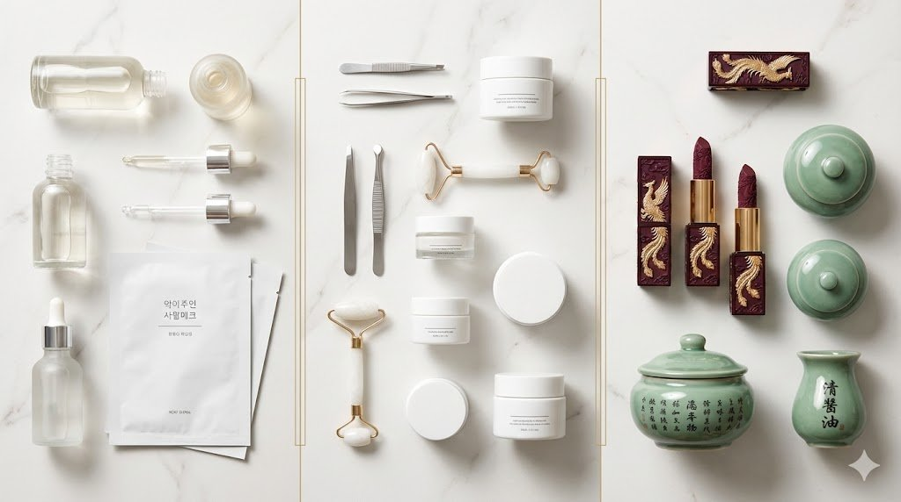
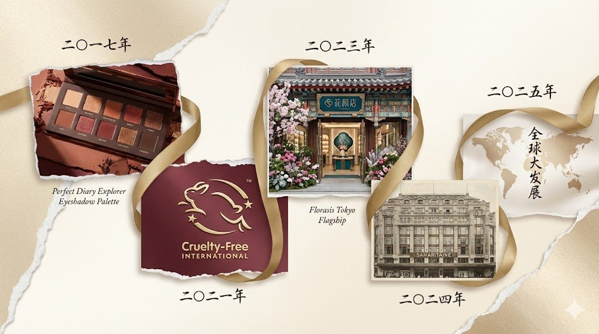
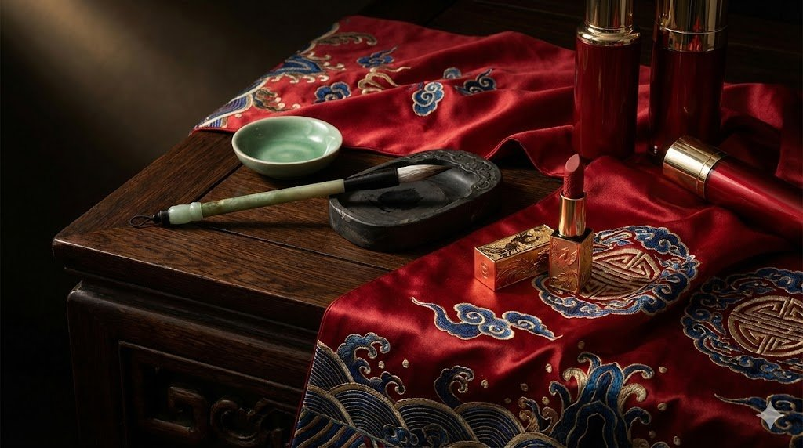
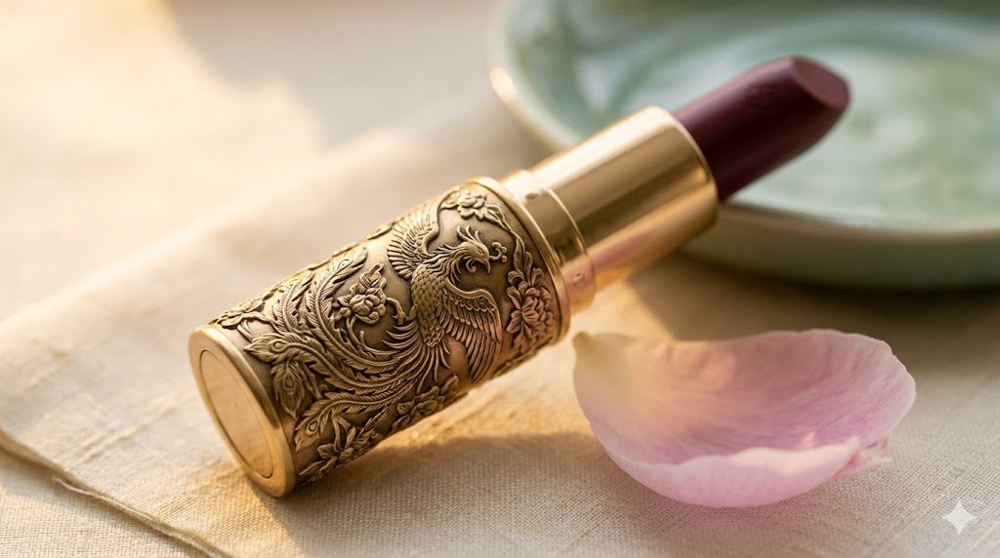

Only 13% of global consumers are aware of C-Beauty. Let that sink in.

While [K-beauty has dominated Western beauty conversations](/beauty/k-beauty-broke-the-algorithm/) for a decade, Chinese beauty brands have quietly built an $18.7 billion global market growing at 10.2% annually—and they're poised to reshape how the world thinks about cosmetics. This isn't merely another regional beauty trend waiting for Western validation. It's a cultural, technological, and commercial force that's already outselling most European heritage brands in key Asian markets.

Florasis lipsticks command higher prices than Chanel in Japanese department stores. Flower Knows sells out collections within hours across North America and Europe. Perfect Diary's Singles' Day sales once exceeded $100 million in a single afternoon. Yet somehow, the industry that transformed global beauty journalism hasn't meaningfully covered this revolution.

The awareness gap exists not because C-Beauty lacks sophistication or appeal, but because Western publications haven't known where to look. This guide changes that. Consider it your comprehensive introduction to the brands, philosophies, and cultural forces driving the world's fastest-growing beauty movement.

## What is C-beauty?

C-Beauty refers to cosmetics and skincare brands originating from mainland China, characterised by their fusion of traditional Chinese heritage with modern formulation science. The term encompasses everything from affordable colour cosmetics to premium skincare powered by Traditional Chinese Medicine ingredients—and increasingly, luxury positioning that rivals established European houses.

The distinction from K-Beauty and J-Beauty proves fundamental to understanding C-Beauty's appeal. Where Korean beauty emphasises multi-step routines and "glass skin" aesthetics, and Japanese beauty focuses on minimalist elegance and technological precision, Chinese beauty brands celebrate cultural heritage through packaging, formulation philosophy, and brand storytelling that draws explicitly from millennia of Chinese artistic tradition.

C-Beauty brands integrate traditional Chinese medicinal ingredients—ginseng, angelica, snow lotus, and botanical extracts validated by centuries of use—into modern cosmetic formats. They embrace the guochao movement, translating "national tide," which celebrates Chinese cultural heritage through contemporary consumer products. The result is makeup and skincare that doesn't merely function well but tells stories rooted in Chinese history, philosophy, and aesthetics.

The global C-Beauty product market reached $18.7 billion in 2025 and is projected to grow to $49.2 billion by 2035, according to Future Market Insights research. That represents a 2.63 times increase driven by rising global preference for culturally grounded skincare, clinically supported active ingredients, and ingredient transparency.

## The rise of C-beauty: key milestones

The C-Beauty revolution didn't emerge overnight. Its trajectory reflects China's economic transformation, generational shifts in consumer identity, and the unique dynamics of Chinese digital commerce.

**2017-2018: The Singles' Day Breakthrough**

Perfect Diary's meteoric ascent during Alibaba's Singles' Day shopping festival signaled that Chinese consumers—particularly Gen Z—were ready to embrace domestic beauty brands at scale. The brand demonstrated that homegrown cosmetics could compete on innovation, aesthetics, and cultural relevance, not merely price. By 2021, Perfect Diary's parent company Yatsen had reached annual revenues exceeding 5.4 billion yuan.

**2021: The Animal Testing Reform**

China's relaxation of mandatory animal testing requirements for imported cosmetics opened new possibilities for global expansion. Simultaneously, it validated C-Beauty brands that had already developed cruelty-free formulations, positioning them advantageously for Western market entry where such credentials increasingly matter.

**2022-2023: The Offline Evolution**

Florasis opened its first global flagship store in Hangzhou in December 2022, followed by pop-up stores in Tokyo's Isetan Shinjuku in September 2023. These physical retail experiments proved C-Beauty could translate its digital success into tangible luxury experiences.

**2024-2025: The Global Retail Moment**

Florasis became the first Chinese beauty brand to operate a physical retail presence in Paris, opening a counter at Samaritaine department store in September 2024. The following January, it launched a flagship store at Tokyo's prestigious Ginza Six—the first Chinese cosmetics brand to achieve such positioning in Japan's luxury retail landscape. Japan now accounts for 40% of Florasis's total overseas sales.

By 2025, Chinese cosmetics exports to RCEP markets had surged over 70%, with Chinese brands growing 205% in cross-border shipments through Guangzhou Customs alone. The trajectory suggests C-Beauty is transitioning from regional phenomenon to global industry force.

## Understanding the guochao movement

To grasp C-Beauty's cultural resonance, one must understand guochao—the "national tide" that's reshaping Chinese consumer behaviour across fashion, technology, and beauty.

Guochao represents more than brand preference. It embodies a generational embrace of Chinese cultural identity, driven primarily by Gen Z consumers who grew up during China's period of unprecedented economic growth and global influence. Interest in guochao has skyrocketed 528% compared to a decade earlier, according to research jointly issued by People's Daily and Baidu.

This isn't nostalgia for its own sake. Rather, 78.5% of Chinese consumers now prefer domestic brands, with post-1990 and post-2000 generations accounting for 74% of guochao brand purchases. These consumers seek products that express Chinese heritage through contemporary design—traditional motifs reimagined for modern aesthetics, not museum recreations.

For C-Beauty brands, guochao translates into packaging that incorporates classical Chinese artistic elements, formulations that honour traditional ingredient wisdom, and brand narratives that celebrate Chinese culture without apology. Florasis's elaborately carved lipstick cases featuring phoenix and lotus motifs exemplify this approach, as do Flower Knows' fairytale collections that blend Eastern and Western fantasy aesthetics.

The movement has evolved through what market researchers now call "Guochao 3.0"—a shift from surface-level cultural references to deeper integration of heritage into brand identity. Where early guochao emphasised nostalgia and national symbols, the current wave emphasises cultural confidence, quality parity with international competitors, and authentic storytelling that resonates beyond China's borders.

## The TCM factor: Chinese medicine meets modern skincare

Traditional Chinese Medicine ingredients form the scientific backbone of many C-Beauty skincare formulations—and increasingly, Western researchers are validating what Chinese practitioners have known for centuries.

Pechoin, one of China's most established beauty brands, built its resurgence on TCM-inspired formulations featuring ginseng, angelica, and other botanical ingredients. The brand consistently surpasses 100 million RMB in monthly sales on Douyin, entering the platform's Beauty TOP10 by February 2025. Its success reflects younger Chinese consumers' growing interest in incorporating traditional remedies into contemporary beauty routines.

Key TCM ingredients appearing across C-Beauty formulations include ginseng for revitalization and anti-aging benefits, angelica root for skin brightening and circulation support, snow lotus extract for hydration and environmental protection, and various botanical compounds with documented antioxidant and anti-inflammatory properties.

The validation wave extends beyond anecdotal evidence. Clinical research increasingly supports TCM ingredient efficacy for skincare applications, providing C-Beauty brands with scientific credibility that appeals to ingredient-conscious Western consumers. This represents a strategic advantage: brands can position themselves at the intersection of ancient wisdom and modern science, a compelling narrative for consumers sceptical of both purely synthetic formulations and unsubstantiated wellness claims.

For Western consumers approaching C-Beauty skincare, TCM ingredient integration offers a distinctive value proposition—formulations rooted in empirical tradition, supported by contemporary research, and delivered through modern cosmetic formats.

## The major C-beauty brands to know

### Florasis

Florasis, known domestically as Huaxizi, stands as C-Beauty's most successful luxury ambassador. Founded in 2017 in Hangzhou, the brand draws inspiration from the city's West Lake—a location revered by poets and painters for millennia. Co-founder Ren Gangrui describes the brand's mission as showing "the value of Chinese brands in overseas consumption markets."

What distinguishes Florasis is its unapologetic embrace of traditional Chinese artistry. Products feature intricate bas-relief engravings depicting historical narratives from Chinese culture. The brand's Concentric Lock lipstick became a cult favourite on Amazon Japan, commanding prices exceeding Chanel lipsticks at 6,129 yen versus Chanel's 5,270 yen.

Florasis sells products to over 110 countries and regions through its official website, e-commerce platforms, and expanding offline channels. Its Tokyo flagship at Ginza Six, opened January 2025, marks a significant milestone in C-Beauty's luxury retail evolution. The brand's success demonstrates that Chinese beauty can compete on craftsmanship, heritage storytelling, and premium positioning—not merely affordability.

### Flower Knows

Where Florasis pursues traditional Chinese luxury, Flower Knows has captured global Gen Z audiences through whimsical fairytale aesthetics. Founded in 2016 by Yang Zifeng and creative director Zhou Tiancheng—both previously known in cosplay communities as "Baozi & Hana"—the brand transforms makeup into collectible art.

Flower Knows operates on a "fast beauty" model, launching complete collections every 90 days compared to traditional brands' annual cycles. Collections like Swan Ballet, Strawberry Rococo, Little Angel, and Moonlight Mermaid feature embossed packaging designs that routinely sell out within hours of release.

The brand achieved over 400% year-on-year growth during its 2023-2024 international expansion, with revenues exceeding $10 million across North America and Europe. In December 2025, Flower Knows launched at Ulta Beauty with an assortment of 62 products—marking the American retailer's first C-Beauty partnership and the brand's entry into U.S. mainstream retail.

With a combined Instagram and TikTok following exceeding four million and a loyal fanbase dubbed "Flower Fairies," Flower Knows demonstrates C-Beauty's capacity for building passionate global communities around fantasy-driven brand experiences.

### Perfect Diary

Perfect Diary revolutionized Chinese cosmetics through digital-first marketing and influencer partnerships at unprecedented scale. Founded in 2017, the brand reached billion-yuan revenues faster than virtually any beauty company in history, culminating in its parent company Yatsen's 2020 IPO.

The brand's collaborative strategy—partnerships with the British Museum, Metropolitan Museum of Art, and Beijing Animal Protection Fund—established a template for connecting Chinese cosmetics with global cultural institutions. Its Explorer Eyeshadow Palettes became viral sensations through both product quality and commitment to sustainability causes.

Perfect Diary's trajectory offers lessons about both C-Beauty's potential and its challenges. After rapid growth, the brand faced increasing competition and market saturation, leading to strategic refocusing. Its evolution demonstrates that C-Beauty success requires sustained innovation beyond initial viral momentum.

### Emerging players

**INTO YOU:** Founded in 2019, specializes in lip products, particularly lip clay textures the brand pioneered. Built on values of female empowerment and self-expression, INTO YOU's "shero" series offers 28 shades across five colour families.

**Judydoll:** A favourite among Douyin users, known for audacious colour innovation including blueberry, mint green, and mauve blush shades. The brand opened over 150 retail counters across Malaysia, Russia, and Chile by Q2 2025.

**Catkin:** Established in 2007, combines innovative formulas with packaging featuring traditional Chinese icons—dragons, cranes, and the mythical fenghuang phoenix. For the accessible, trend-led end of the category, our edit of the [best Chinese makeup brands worth buying](/beauty/beauty-best-chinese-makeup-brands/) covers Judydoll, Flortte and their peers in detail.

**Zeesea:** Gained attention through creative collaborations, particularly with British Museum collections, offering accessible price points with distinctive artistic packaging.

## C-beauty vs K-beauty: what's the difference?

Understanding C-Beauty requires distinguishing it from the Korean beauty wave that dominated the 2010s. We have set out the [full comparison of the two philosophies](/beauty/c-beauty-vs-k-beauty-2026/) elsewhere; in brief, both represent Asian beauty innovation, yet their philosophies, product focuses and marketing approaches differ fundamentally.

**Philosophy**

K-Beauty centres on skincare routines designed to achieve "glass skin"—translucent, dewy, poreless complexion through multi-step regimens emphasising hydration and barrier protection. The approach is preventive, treating skincare as daily maintenance rather than corrective intervention.

C-Beauty embraces a more holistic philosophy rooted in TCM principles—balance, harmony, and working with the body's natural systems. It also prioritises cultural expression through beauty, treating cosmetics as vehicles for heritage celebration rather than merely functional products.

**Product Focus**

K-Beauty built its reputation on skincare innovation: essences, ampoules, sheet masks, and sun protection. The Korean market leads globally in facial care revenue, with moisturizers and cleansers as dominant categories.

C-Beauty excels in colour cosmetics, particularly lip products and complexion items that incorporate traditional artistic elements. While C-Beauty skincare exists and grows rapidly, the category's global breakthrough has come through makeup with distinctive aesthetic identities.

**Marketing Approach**

K-Beauty's global expansion leveraged K-pop and K-drama cultural exports—celebrity endorsements by stars like Song Hye Kyo created aspirational associations that transcended beauty into lifestyle.

C-Beauty brands have primarily grown through social commerce platforms like Douyin and Xiaohongshu domestically, then TikTok and Instagram internationally. Influencer partnerships drive awareness, but brand differentiation often relies on product distinctiveness rather than celebrity association.

**Market Position**

K-Beauty currently dominates skincare globally, with the US accounting for 55% of total K-beauty overseas online sales in the first half of 2025—up from 20% in 2022. However, China's share of K-beauty exports dropped from 66% to 20% during the same period, driven by intensified competition from domestic C-beauty brands.

This shift suggests C-Beauty is successfully capturing Chinese consumers who might previously have reached for one of the [Korean labels worth knowing](/beauty/k-beauty-brands-2026/), while simultaneously building international audiences through differentiated positioning.

## Where to buy C-beauty products

Accessing C-Beauty products has become increasingly straightforward for Western consumers, though navigating authenticity and shipping remains important.

**Global Retailers**

Ulta Beauty now carries Flower Knows in the United States. Urban Outfitters introduced Flower Knows to North American audiences beginning in 2023. Sephora stores in select markets carry various C-Beauty brands.

**Direct Brand Sites**

Florasis operates florasis.com with global shipping to over 110 countries. Flower Knows offers international e-commerce with typical shipping times of 1-2 weeks to North America and Europe.

**Amazon**

Multiple C-Beauty brands maintain official Amazon storefronts, providing Prime shipping options in major markets. Florasis's Amazon Japan launch achieved top-three lipstick sales rankings on debut.

**Authenticity Considerations**

Given C-Beauty's popularity, counterfeit products exist in unofficial channels. Purchasing from authorized retailers, official brand websites, or verified Amazon storefronts ensures authentic products. When in doubt, brand official sites list authorized retailers by region.

## The future of C-beauty

C-Beauty's trajectory suggests transformation from emerging trend to established global beauty segment. Several developments will shape its evolution.

**Fragrance Emergence**

Chinese fragrance brands represent C-Beauty's next major category expansion. The fragrance segment shows 14.7% CAGR growth, with brands like To Summer gaining international attention. Perfume offers C-Beauty an avenue into luxury categories historically dominated by European houses.

**Retail Expansion**

Following Florasis's Paris and Tokyo success, expect increased offline retail presence from C-Beauty leaders. Physical stores provide trial opportunities essential for cosmetics consideration and enable brand storytelling experiences difficult to replicate online.

**Premium Positioning**

The high-end beauty products sector is expected to capture 53% of China's domestic market share by 2025. C-Beauty brands are increasingly competing on quality and prestige rather than affordability, positioning themselves alongside rather than beneath established luxury names — a move that sits squarely within the wider [shift toward quiet luxury](/guides/the-complete-guide-to-quiet-luxury/) reshaping how Asian consumers assign value.

**Global Supply Chain Development**

As Florasis's Chen noted in Business of Fashion, C-Beauty's global ambition requires "not just doing retail but also looking into a global supply chain." Investment in international logistics, formulation adaptation for diverse skin tones and preferences, and regulatory compliance across markets will determine which brands successfully scale.

The C-Beauty story is ultimately about cultural confidence translated into commercial success. Brands like Florasis and Flower Knows aren't asking for Western validation—they're offering distinctive perspectives on beauty that happen to appeal universally. For consumers tired of identical luxury conglomerate formulations, C-Beauty provides genuine alternatives rooted in different traditions, aesthetics, and values.

Drawn to Florasis's artisanal craftsmanship, Flower Knows' fairytale whimsy, or the innovative formulations emerging from Chinese cosmetics research — the category offers discoveries unavailable elsewhere. The 87% of global consumers who haven't yet encountered C-Beauty have something remarkable waiting for them.

* * *

**Author's Note:** This guide represents arahkaii's commitment to covering the fashion and beauty developments that matter, regardless of where they originate. As C-Beauty continues its global expansion, we'll provide ongoing coverage of brand launches, trend analysis, and the cultural forces shaping this fascinating industry.
