The kitchen at Restaurant Fiz is ten steps from your table. You can hear the ladle touch the bottom of the copper pot. The room is narrow. The lighting is low. The tasting menu has eleven dishes, arranged in a sequence that Chef Hafizzul Hashim calls — without ceremony — a story.

This is what halal fine dining looks like in Singapore in 2026: not apologetic, not abbreviated, not a concession to anything. It is the table.

Singapore has always been a place where serious eating and halal observance share a neighbourhood. What changed in the last three years is the register. Tasting menus earning Michelin recognition. Malaysian heritage cuisine placing at 20th on Asia's 50 Best Restaurants. A generation of chefs building craft-led kitchens — the same patient, craft-first ambition that has driven [Korean heritage brands](/style/korean-heritage-brands-renaissance/) to reshape how Seoul exports taste — now visible in Singapore's halal dining rooms. The conversation no longer asks whether halal can sustain fine dining ambition. The answer has already been plated.

This list covers twelve kitchens for dinner; several also anchor the city's serious halal Sunday brunch, and most sit within reach of a well-planned [48-hour Singapore stopover](/travel/singapore-stopover-guide-48-hours/). Each one is led by the room and the chef, not the price. Every entry's halal status is declared plainly — because the distinction between MUIS-certified, Muslim-owned, and pork-free matters, and collapsing them into a single word does no diner a service. Book early.

* * *

## What counts as halal fine dining in Singapore?

Three categories are in use across this list, and they are not interchangeable.

**Halal-certified (MUIS)** means Singapore's Islamic Religious Council has audited the kitchen: ingredients, sourcing, preparation, and cross-contamination protocols. This is the gold standard. It covers the full supply chain, not just the menu description.

**Muslim-owned** means the restaurant was founded and is operated by Muslims. The kitchen typically follows Islamic dietary guidelines, but MUIS certification is not required. Some Muslim-owned restaurants serve alcohol for non-Muslim guests. The category is broader than MUIS certification and narrower than "halal-friendly."

**Pork-free / beef-free / alcohol-free** is a partial accommodation. Not a substitute for the first two categories, but relevant for Muslim diners navigating otherwise non-halal dining rooms. Where this is the only applicable category, it is stated plainly.

Every entry on this list specifies which applies. The obligation to read the status note belongs to the diner; ours is to write it without softening.

* * *

## The Tasting Menu Tier

The most significant shift in Singapore's halal dining scene over the past three years is not a single restaurant opening. It is the arrival of serious tasting menus — kitchens with a culinary argument that runs across eight, ten, eleven courses — in the halal space. Two rooms define the conversation.

**Restaurant Fiz** _Muslim-owned; pork-free; no lard; wine menu available for non-Muslim guests_ Tras Street, Tanjong Pagar | Tasting menus from S$79 (lunch) to S$188++ (full dinner)

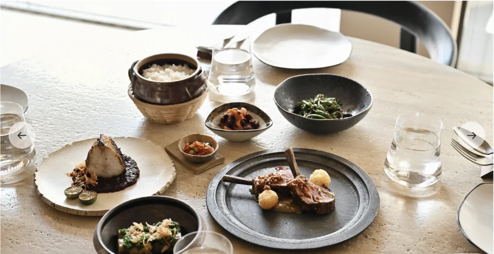

Chef Hafizzul Hashim spent years in London's Michelin-starred kitchens — Mirabelle, Chez Bruce, Jean Georges Tokyo — before returning to open a restaurant that centres Malaysian produce and culinary heritage. The result holds Singapore's first Michelin Green Star for environmental sustainability in halal cuisine: eleven courses, minimal ceremony, and a room that earns its reputation through restraint rather than announcement.

The cuisine is contemporary Southeast Asian, grounded in Malaysian flavour logic but not bound by its forms. Bunga kantan — torch ginger flower — may appear as a reduction rather than a sliced component. Petai beans arrive in a form that reframes their bitterness as a note rather than a statement. The communal structure of the main courses re-enacts the logic of shared Malay dining. It is not a conceit.

Allow two hours minimum for the Sajian Warisan full dinner experience. The wine list is present; ordering from it is not expected of Muslim diners, and the service does not imply otherwise.

_Halal note: Restaurant Fiz is Muslim-owned but is not MUIS halal-certified, as alcohol is served on premises for non-Muslim guests. Diners requiring full MUIS certification should proceed to the entries below._

* * *

**Seroja** _Muslim-friendly; pork-free; alcohol served for non-Muslim guests_ Stanley Street, Tanjong Pagar | Tasting menu format; reservation required

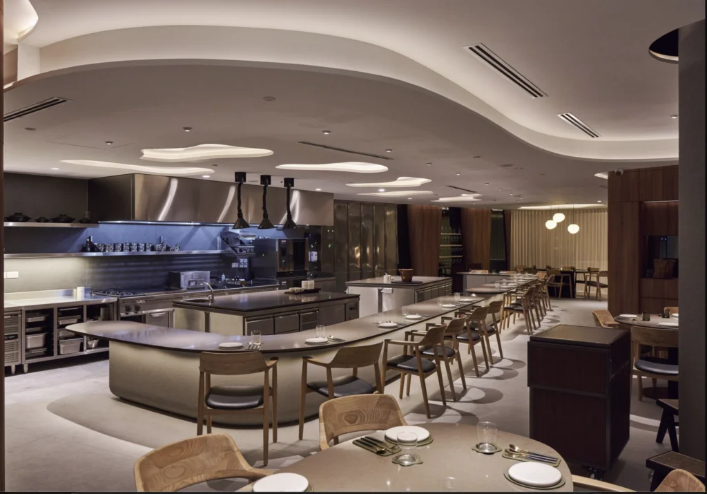

Chef Kevin Wong's Seroja holds a Michelin star and ranks 20th on Asia's 50 Best Restaurants 2026 — a position built on dishes that trace the Malay archipelago through sourcing and technique rather than nostalgia. Since opening in 2022, the restaurant has also held Singapore's inaugural Michelin Green Star.

The menu draws from Singapore's and Malaysia's markets, shifting with the season and what Wong can source. The consistency is not in the dishes but in the intent: each course has a central argument — one flavour relationship, one technique decision — that it is asking you to notice. Wong's cooking does not reach for applause. It trusts the work to make its own case.

The dining room is calm. Service is well-read without performance. Seroja's rise from its debut placing to 20th on Asia's 50 Best in three years is the clearest signal that Singapore's halal-adjacent kitchen ambition has found its form.

_Halal note: Seroja is not MUIS halal-certified. The kitchen is pork-free and operates with Islamic dietary guidelines for ingredients, but alcohol is available for non-Muslim guests. Muslim diners are welcome; the team manages dietary requirements with care._

* * *

## The French-Malayan School

Two kitchens in Tanjong Pagar are making the case that French fine dining technique applied to Malayan ingredients is not fusion — it is a coherent culinary language with its own rules. Both are MUIS halal-certified.

**The White Label Restaurant** _Halal-certified (MUIS)_ Telok Ayer Street | Approximately SGD 90–150++ per head for the tasting menu

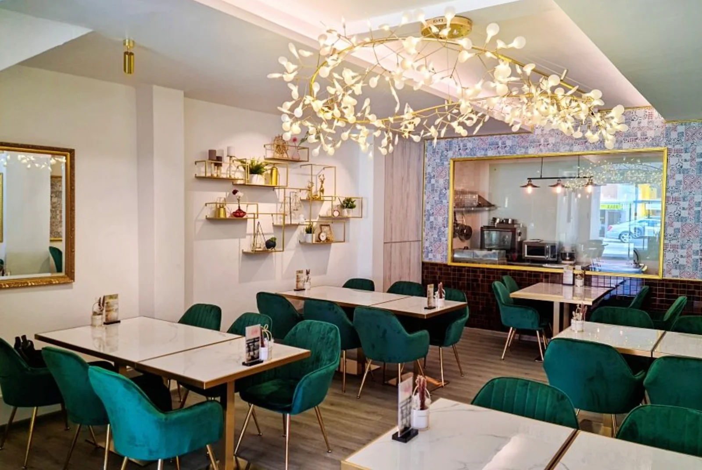

The room at The White Label is composed: pale walls, linen on the tables, menus that do not announce the cultural crossover before you taste it. Chef Hissyam Jaafar's cooking makes the first move. A soup arrives with galangal running through it, quietly, inside something that reads visually as a cream-based European starter. A main course references pandan through a technique closer to French pastry logic than Southeast Asian street food. The flavour memory is Malayan; the form is French.

The White Label also pioneered the halal trolley service concept in Singapore — a formal French gesture applied to halal dining — which says something about the kitchen's ambition. Reserve at least two weeks ahead for weekend tables.

* * *

**Restaurant Espoir** _Halal-certified (MUIS)_ Duxton Hill | Approximately SGD 80–130++ per head

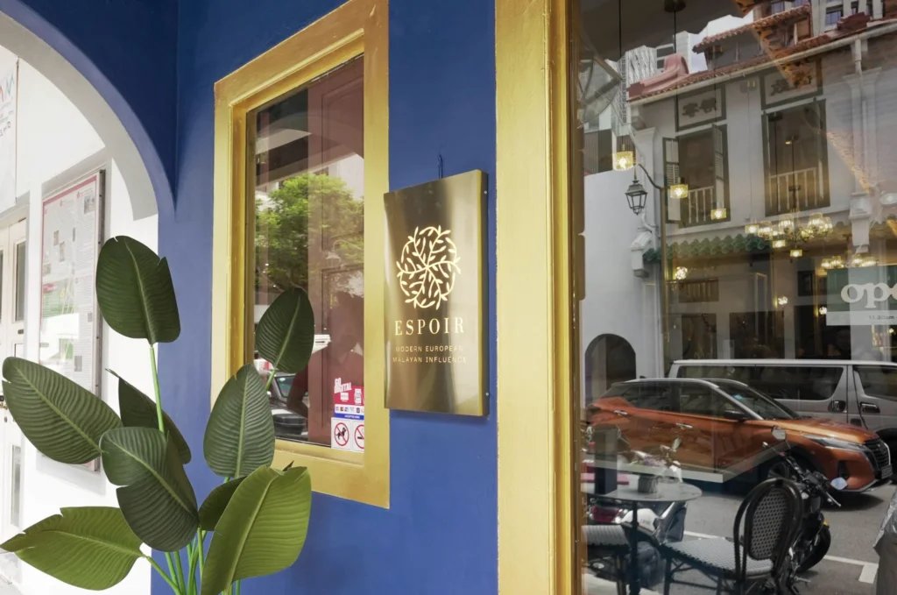

Espoir occupies a Duxton Hill shophouse, second floor, a room that gives you the street below and the plate in front of you. The kitchen blends European and Malayan approaches: classical technique and seasonal European ingredients brought into conversation with local flavour memory and the nostalgic logic of Malayan home cooking.

The starters tend to carry the most considered cooking on any given evening — the section where the European-Malayan argument is made most convincingly. Desserts are consistent. The value for the level of execution is strong.

* * *

## The Middle Eastern and Nusantara Table

**Oud Restaurant** _Halal-certified (MUIS)_ Kandahar Street, Kampong Glam | Approximately SGD 80–140++ per head

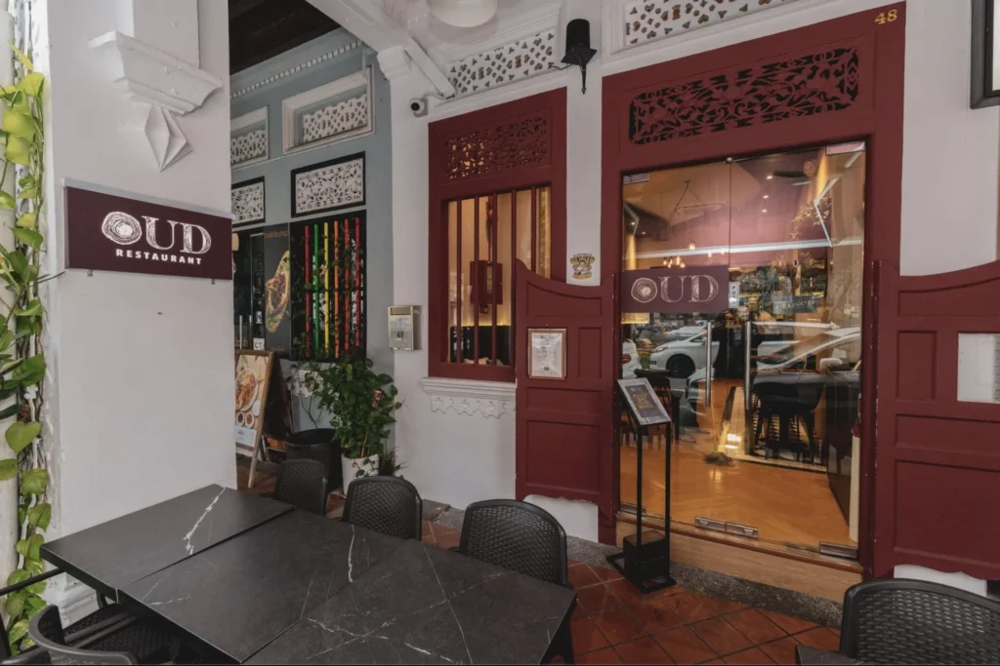

The woodfire grill at Oud is the kitchen's statement. You smell it before the bread arrives. The open kitchen is positioned beside the dining room — not opposite it — so the cooking is part of the experience from the moment you sit down.

Head Chefs Indra and Ridz bring experience from Michelin-starred kitchens into a menu that combines Middle Eastern technique — fire, charcoal, slow-cooked and charred protein — with European plating precision. The neighbourhood context on Kandahar Street is legible in the menu: the spice trade history, Arabic culinary influence, the flavour logic of a port city's most cosmopolitan district running through the sourcing decisions. Oud is built for a long dinner, with a private dinner party format suited to groups of six or more.

* * *

**Permata at Gedung Kuning** _Halal-certified (MUIS)_ 73 Sultan Gate, Kampong Glam | Chef Mel Dean | From SGD 58++ per head

The building earns its place in the conversation before the food does. A 19th-century Palladian mansion — Gedung Kuning, the Yellow House — set beside the Istana Kampong Glam, with ceilings high enough to carry the noise of a full room without losing the intimacy of your own table. Chef Mel Dean leads a kitchen focused on Nusantara cuisine: the cooking of the Malay archipelago, drawing from Indonesian, Malaysian, Bruneian, Thai, and Singaporean traditions across five stations.

The format is a buffet — more than fifty dishes — which might read as casual until you look at the cooking standard per plate. Permata was a finalist for Best Halal Restaurant (Fine Dining) at the Epicurean Star Awards two consecutive years, which reflects a kitchen taking the remit seriously. The setting and the cooking earn each other.

* * *

**The Malayan Council at Fullerton** _Halal-certified (MUIS)_ 3 Fullerton Road, Fullerton Waterboat House | Daily from 11am

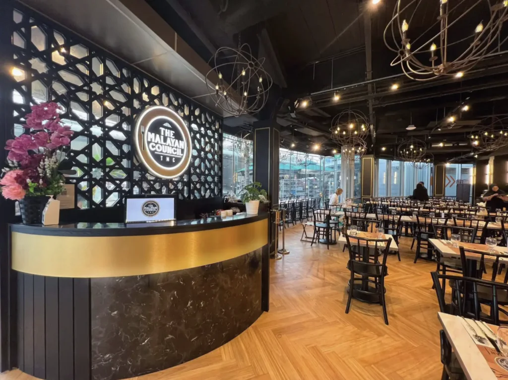

The view from this room — Singapore River, Marina Bay beyond it, the Esplanade bridge at night — is the most composed skyline the city offers a dining table. The Malayan Council's Fullerton outlet pairs it with Modern Malay and local cuisine: the 2026 menu leads with Seafood on Ice, Chilli Crab, and Kueh Pie Tee alongside a spread drawing across the city's heritage traditions.

This is the celebration table: a milestone dinner, a family occasion, a meal that requires the room to carry part of the weight. The cooking is reliable. The location does the rest.

* * *

**Malayan Settlement** _Halal-certified (MUIS)_ 3B River Valley Road, Clarke Quay

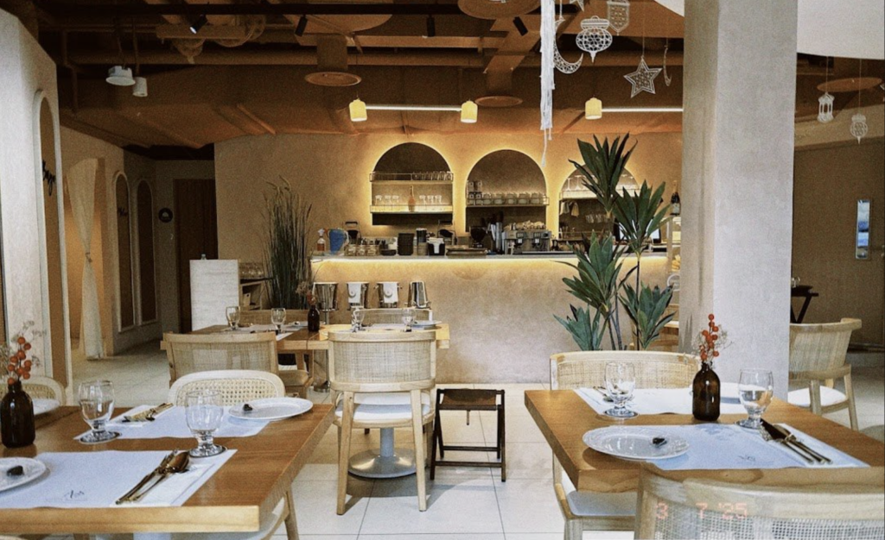

The youngest addition to The Malayan Council group brings a different register: a kampong-themed environment with live cultural performances and a menu that reads traditional Malay flavours through a contemporary lens. Roti Kirai with Beef Ribs. Asam Pedas Seafood with Aglio Olio — the fusion is specific rather than decorative.

Clarke Quay is a tourist district. Malayan Settlement is not cooking for tourists. The heritage culinary work in the kitchen stands apart from the address.

* * *

## The Premium Protein Counter

For the diner whose argument with a menu begins with the quality and provenance of the protein — the breed, the prefecture, the grade — two kitchens are making the most rigorous halal case in Singapore.

**Charr'd** _Halal-certified (MUIS)_ 324F Changi Road | 11am–10pm, closed Mondays | Approximately SGD 120–200+ per head

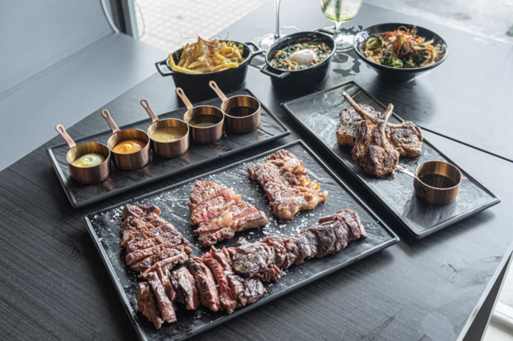

Singapore's first halal-certified A5 wagyu steakhouse imports whole Kuroge cows from Mie Prefecture, Japan. The decision to buy whole animals rather than portioned cuts was made for freshness and full supply-chain traceability. Ribeye, sirloin, and tenderloin are the three cuts. The sauces are halal-certified through the complete chain. The approach is direct: the best available beef, properly handled, without distraction.

The room is more casual than the price point. The investment is on the plate.

* * *

**Gyusei Gyukatsu Wagyu Steakhouse** _Halal-certified (MUIS)_ Hotel Clover, Bugis | Open from early 2026

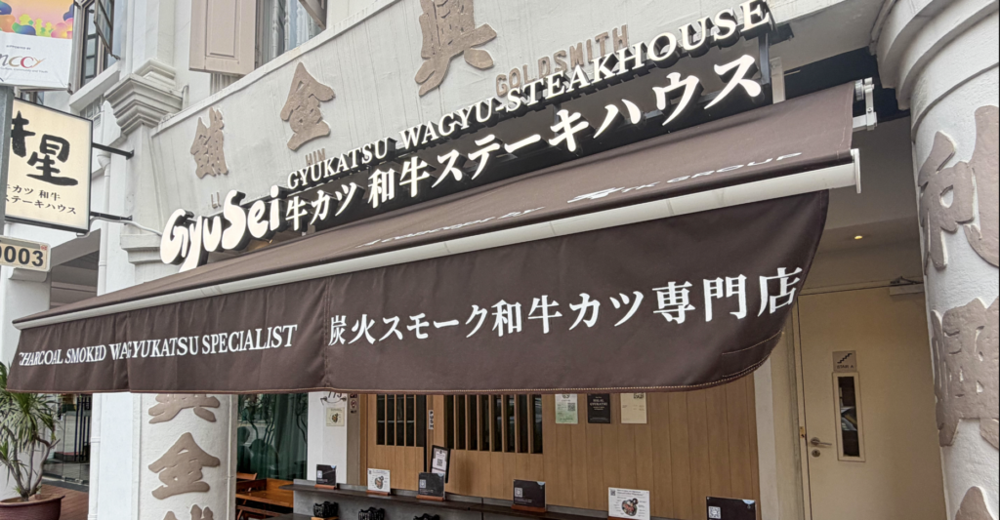

Singapore's first halal A5 wagyu katsu specialist opened at Hotel Clover in Bugis, introducing charcoal-smoked preparation to a format — wagyu katsu — that is already precise in its requirements. The lightly fried slices of A5 Kuroge arrive with a heated stone, placing the final cook in the diner's hands: bring the slice to your preferred internal temperature and eat it there.

The concept is Japanese in its discipline. The halal certification covers the complete supply chain from import to service.

* * *

## The Indian Omakase and the Heritage Table

**Ammakase** _Pork-free; beef-free; contact the restaurant directly to confirm current MUIS halal certification_

#04-48, One Raffles Place | Lunch and dinner, Monday–Saturday

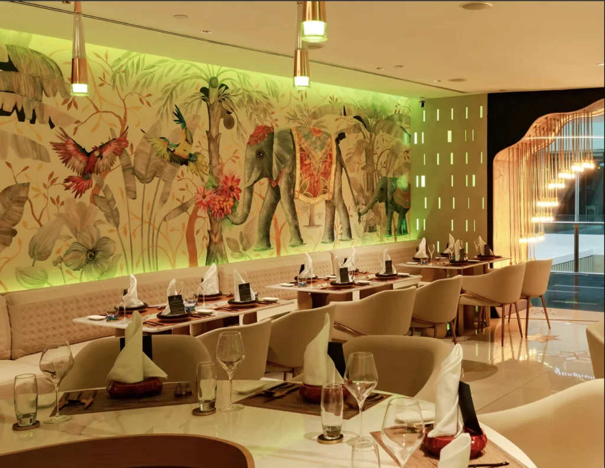

The name combines _amma_ — mother in Tamil — with _omakase_ — leave it to the chef. The concept is the world's first Indian omakase fine dining experience, and it holds Michelin selection. Chef Robin leads a six- to ten-course tasting menu drawing from coastal India and Sri Lanka — West Bengal, Gujarat, and the southern coast — built with French technique and plated without the visual grammar of Indian casual dining.

The menu is not announced in advance. You entrust the kitchen. Pork-free and beef-free throughout.

_Halal note: Ammakase is pork-free and beef-free. Muslim diners should contact the restaurant directly to confirm current MUIS halal certification and alcohol policy before booking._

* * *

**Rempapa by Chef Damian D'Silva** _Non-halal — included for Chef D'Silva's unmatched command of Singapore's disappearing Eurasian-Peranakan culinary traditions_ Park Place Residences at PLQ, Paya Lebar

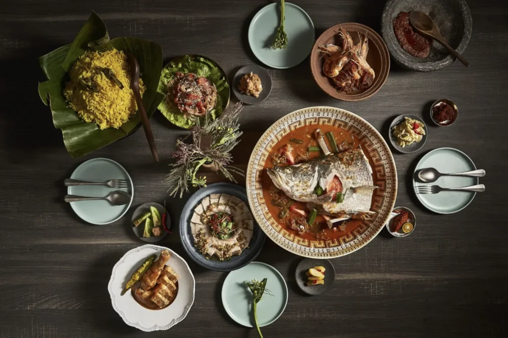

Chef Damian D'Silva has spent thirty years researching and cooking the dishes that defined Singapore's Eurasian, Peranakan, Malay, Indian, and Chinese heritage kitchens. Rempapa is where that work becomes a menu. The Fried Chee Cheong Fun appears on multiple Singapore best-of lists. The Babi Pongteh — pork, braised, cooked as D'Silva's family recipe demands — confirms that this kitchen is cooking its actual heritage.

This entry is included because D'Silva's approach to heritage cooking is the most rigorous in Singapore, and several menu sections navigate pork-free. Muslim diners should discuss specific dishes with the restaurant directly before visiting.

_Explicit status: Rempapa is not MUIS halal-certified. Pork is cooked in the kitchen. This is a non-halal entry, included for its unmatched cultural and culinary significance and the pork-free dishes available alongside. Verify individual dish ingredients directly with the restaurant._

* * *

## The Editor's Pick

Restaurant Fiz earns the top position — not because it is the most accessible (it is not), or the most formally halal-certified (it is Muslim-owned, not MUIS-audited). It earns it because Chef Hafizzul Hashim's eleven courses carry an argument from the first amuse-bouche to the final sweet: that Malaysian produce, handled with rigour and precision, requires no apology and no explanation.

The [quiet confidence that defines the best of restrained Asian luxury](/guides/the-complete-guide-to-quiet-luxury/) — craft over announcement, depth over surface — runs through the finest rooms on this list. The kitchens are the current answer to how high Singapore's halal fine dining scene intends to reach.

Next year, some of them will have company.

### Read next

- [Forty-eight hours in Singapore, done properly](/travel/singapore-stopover-guide-48-hours/)
- [Southeast Asia's quiet modest-streetwear revolution](/style/modest-fashion-streetwear-southeast-asia-muslim-fashion-2025/)
- [Asian philanthropy's quiet revolution](/culture/asian-billionaire-philanthropy-quiet-revolution/)
- [The conscious-luxury manifesto](/living/the-conscious-luxury-manifesto-sustainable-living/)
