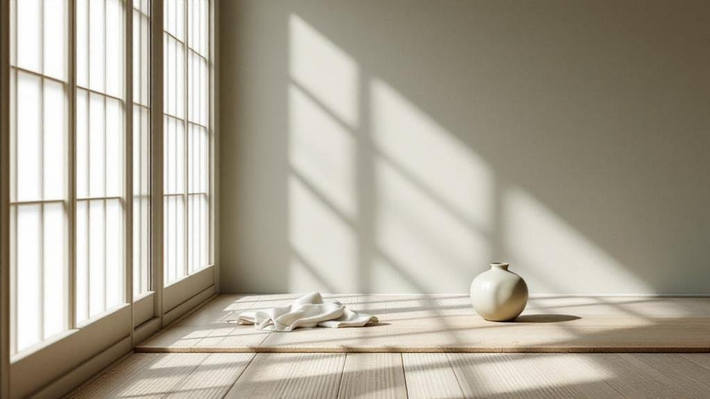
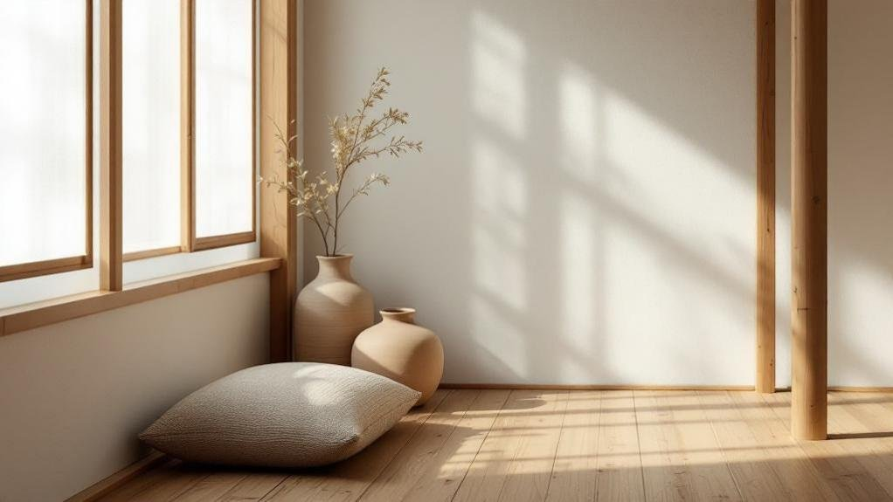
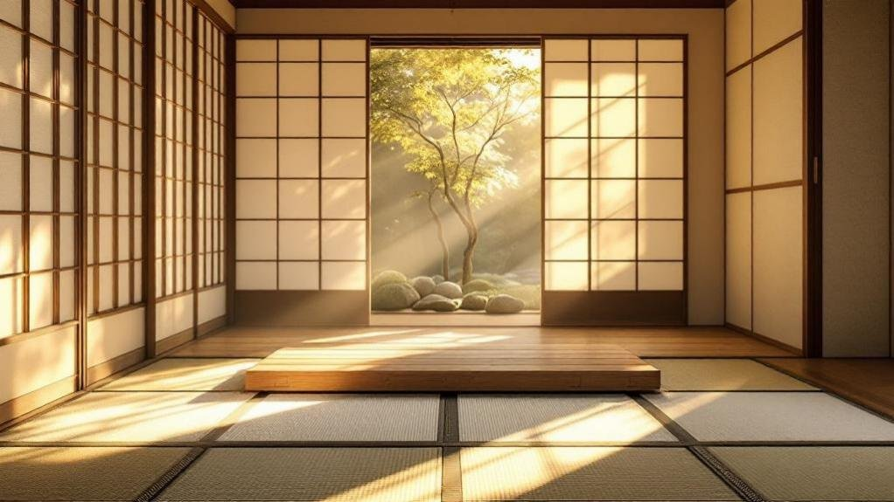

Walk into a room shaped by the Asian minimalist tradition and something feels different—calmer, clearer, more intentional. It is not the absence of things that registers first, but the presence of space: light falling on an uncluttered floor, a single ceramic bowl allowed its own shelf. This guide traces the philosophy behind that feeling—Zen restraint, wabi-sabi, the Japanese idea of *ma*—and how to apply it, practically, to a small home.

## Philosophy and core principles

This design philosophy roots itself in Zen Buddhism, where less truly becomes more. You're encouraged to practise [mindful consumption](/living/the-conscious-luxury-manifesto-sustainable-living/), choosing only what serves your life meaningfully. Intentional living guides every decision you make about your space.

The concept of wabi-sabi teaches you to find beauty in imperfection and simplicity. Rather than hiding scratches on wood or cracks in ceramics, you embrace them as signs of authentic living.

Worn textures tell stories. This approach strips away unnecessary elements, allowing essential pieces to shine. Your space becomes a sanctuary for reflection and peace, free from clutter demanding your attention.

## Natural materials and textures

When you choose natural materials for your space, you're bringing in textures that tell their own stories—think of wood surfaces marked by years of use or handmade ceramics with uneven glazes.

These imperfections aren't flaws; they're the heart of minimalist design, creating depth and connection through honest, visible wear.

Pairing sturdy wood furniture with soft linens and cotton textiles gives your room warmth while keeping things simple and touchable, inviting you to actually live in and enjoy your space.

### Wood grain stories

Because wood naturally carries the marks of time and weathering, it becomes far more than just a building material in Asian minimalist design—it becomes a storyteller.

Each wood grain pattern and storytelling texture reveals your space's history and character.

When you choose a wooden floor or furniture piece, you're inviting nature's autobiography into your home. That scratch? It marks a moment lived. Those subtle colour variations? They show the wood's journey from forest to room.

You don't need to hide these imperfections. Instead, embrace them. A weathered wooden shelf displays its age beautifully, grounding your minimalist space in authenticity.

Natural finishes enhance rather than mask these details, creating depth that manufactured materials simply can't match.

This approach transforms everyday objects into meaningful elements.

### Textile simplicity and touch

Just as wood grain tells a story, the fabrics you choose whisper their own tale of simplicity and intention. Natural fibres like linen and cotton create textile harmony throughout your space, offering tactile comfort without unnecessary embellishment.

These materials age gracefully, developing subtle wrinkles and softness that deepen their character over time. A linen throw draped over a simple chair invites touch and warmth.

Cotton bedding breathes naturally, supporting restful sleep in your minimalist bedroom.

The beauty lies in their honesty. These fabrics don't pretend to be something they're not—they simply exist as themselves.

## Colour palettes and lighting for serene spaces

How do you want your space to feel when you step inside? Your colour choices and lighting directly shape that experience through colour psychology and ambient lighting — the same [conscious, considered approach](/living/the-conscious-luxury-manifesto-sustainable-living/) that runs through everything in a pared-back home.

Neutral tones—whites, beiges, and soft greys—reflect natural light, making rooms feel larger and calmer. These colours encourage quiet reflection while supporting emotional comfort.

Wooden browns and gentle greens from plants add warmth without overwhelming your senses.

Lighting matters equally. Natural light through large windows creates openness, while soft ambient lighting in evenings prevents harshness.

Consider these approaches:

- Position furniture near windows to maximise daylight exposure
- Use warm-toned bulbs for evening relaxation
- Install dimmers for flexible mood control

Correlated colour temperature in your lighting affects how you perceive colours throughout the day.

Together, these elements create the peaceful sanctuary you're seeking.

## Space optimisation through negative space

When you walk into a cluttered room, your mind feels scattered—but intentional emptiness does the opposite.

Negative space, or "ma" in Japanese design, refers to the purposeful void you leave undecorated. This breathing room isn't wasted space; it's strategic calm — the spatial cousin of [quiet luxury's](/guides/the-complete-guide-to-quiet-luxury/) restraint, where what you withhold matters as much as what you show.

Empty walls make rooms feel larger and more peaceful.

Consider floating shelves instead of bulky cabinets—they free up floor space while storing essentials. Wall-mounted furniture lifts items off the ground, creating visual lightness.

Asymmetrical arrangements introduce organic movement without cramping your environment.

When you practise mindful breathing in open areas, you'll feel the difference immediately. The space around you matters as much as what fills it.

Less truly becomes more when you embrace emptiness intentionally.

## Functional furniture that serves multiple purposes

Now that you've created breathing room with intentional emptiness, it's time to fill that space thoughtfully with furniture that actually works for you.

Asian minimalism celebrates versatile designs that serve double duty without cluttering your home.

Consider these space saving solutions:

- Low platform beds with built-in storage drawers underneath for seasonal clothing and bedding
- Nesting tables that stack compactly when you need floor space for movement or meditation
- Wall-mounted desks that fold down, transforming into shelving when not in use

Each piece you choose should earn its place by performing multiple functions — a discipline that mirrors the [cost-per-wear thinking](/guides/the-complete-guide-to-investment-dressing/) of a well-edited wardrobe.

> Every piece of furniture should earn its place by serving multiple purposes in your home.

A simple wooden bench becomes seating, storage, and a meditation spot.

This intentional approach means you're not just decorating—you're creating a home that genuinely supports how you live, breathe, and move through your space daily.

## Creating harmony between indoors and outdoors

Once you've mastered the art of intentional living inside your home, the next step is dissolving the boundaries between your interior spaces and the natural world beyond.

Large windows and glass doors blur these lines, letting outdoor aesthetics flow seamlessly into your rooms. Position furniture to frame views of gardens or trees outside.

Indoor gardens bring nature directly into your living space. Potted plants on shelves or windowsills create living connections to the outdoors.

Consider shoji screens that filter light while maintaining that open feeling.

Cross-ventilation matters too. Open windows regularly to let fresh air circulate, helping you experience seasonal changes — and, in [a tropical climate](/living/energy-efficient-home-cooling-tropical-southeast-asia/), easing the load on the air-conditioning.

This approach transforms your small space into something that feels expansive and alive.

## Practical applications for small-space living

When you're working with limited square footage, you'll find that multi-functional furniture becomes your greatest ally—think murphy beds that fold into walls, low platform tables that offer storage underneath, and ottomans doubling as seating plus hidden compartments.

Strategic organisation transforms small spaces by using vertical wall space, floating shelves, and built-in cabinets that keep your essentials accessible without eating up precious floor room.

### Multi-functional furniture solutions

Because small spaces demand smarter choices, multi-functional furniture becomes your secret weapon for living well without feeling cramped.

These adaptable layouts transform your home by serving double duty, allowing you to maximise every square inch.

Multi-use designs work brilliantly when you're intentional about what enters your space.

Consider these practical solutions:

- Storage ottomans that hold blankets while providing seating and a footrest
- Murphy desks that fold against walls, creating workspace without consuming floor area
- Low platform beds with built-in drawers underneath for seasonal clothing and linens

Beautifully crafted pieces combining storage with seating or sleeping surfaces eliminate clutter while maintaining the minimalist aesthetic.

Each furniture item earns its place by serving multiple purposes, reflecting the Asian principle that function and form shouldn't compete—they should dance together harmoniously.

### Strategic storage and organisation

Smart storage transforms cramped quarters into functional havens where everything has its place.

Thoughtful organisation makes the most of limited space while maintaining minimalist aesthetics.

Consider these practical storage solutions:

**Vertical storage**

Wall-mounted shelves and floating cabinets draw your eye upward, freeing valuable floor space.

You create breathing room by using often-overlooked wall areas effectively.

**Hidden storage**

Low-profile storage benches and under-bed drawers keep necessities accessible yet invisible.

This approach keeps your environment visually calm and clutter-free.

**Multipurpose pieces**

Choose furniture serving double duty—ottomans with storage compartments, cabinets doubling as room dividers.

You're investing in pieces that earn their space through functionality.

Strategic organisation doesn't mean sacrificing comfort.

You're simply being intentional about what stays, where it lives, and how it serves your daily life mindfully.
