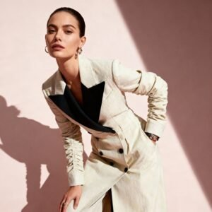
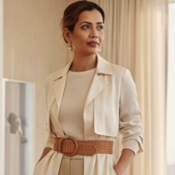
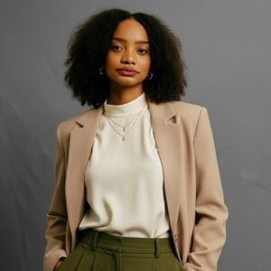

## Arahkaii: Singapore-based curation for Asia's most discerning women.

Your guide to Asia's best in fashion, beauty, and lifestyle — where great design meets real stories.

We spotlight what’s truly worth knowing: Independent designers perfecting their craft Beauty brands that genuinely deliver Makers creating pieces you'll cherish forever

Think of us as that friend who always finds the best stuff first — more in-the-know than your most stylish friend, but never making you feel like you're missing out.

## What's in a Name?

**Arah** means _direction in Bahasa_ **Kaii** means _**k**ind, **a**rtful, **i**ndependent, **i**nspired_.

Together, it’s our compass — pointing you toward brands doing things right, stories worth your time, and a way of living that feels good without trying too hard.

## What We Do

We cover fashion, beauty, home, wellness, and culture across Asia and beyond. From emerging designers in Jakarta to established brands reinventing their craft — if it’s quality, thoughtful, and worth knowing about, we’re on it.

Every feature, every recommendation, every brand we spotlight has been chosen carefully. We don’t cover everything. We cover what matters.

"We're building something different — where you discover brands worth supporting and stories that actually stick with you."

## Why We Started This

Discovering incredible designers, beauty founders, and makers who deserved far more attention inspired us. Talented creators with exceptional work but no platform to truly shine.

So we built one. Arahkaii exists to close that gap. To champion creators who deserve your attention, whether from a small studio or an established ethical brand. For you? It means discovering brands you’ll want to support, reading content that respects your time, and knowing that everything we recommend, we genuinely stand behind.

## Meet the Founders

### Lina

_**Founder, Creative Director & Editor-in-Chief**_

Lina started Arahkaii after countless moments discovering amazing brands and wondering, "Why isn't anyone talking about this?" She leads what we cover and how we say it, ensuring great content makes you want to keep reading—not just skim and scroll. Currently building this platform while defending her slow morning coffee ritual as absolutely necessary for creative thinking. Her rule: if you wouldn't actually want to read it, don't publish it.

### Nadra

_**Co-Founder & Head of Content**_

Nadra runs content  with a Gen Z perspective on what actually matters. She crafts authentic voices and ensures we speak like a friend, avoiding buzzwords. When not editing, she's hunting vintage finds, exploring new neighbourhoods, curating playlists that match the vibe, lost in a good book and always searching for the city's best matcha.

## **How We Work**

We write about brands, and we make it easy to support them. Every story connects to our shop at shop.arahkaii.com, so when you discover something you love, you can actually buy it. Simple: Read. Discover. Shop. Support.

## What's Next

We launched in late 2025 and we're growing thoughtfully. Right now, we're reaching out to designers and brands we genuinely want to work with — building relationships, not just filling pages.

In 2026, we're expanding coverage, launching in-depth designer stories, and making shopping even easier. We're bringing on more voices and growing the team. But always keeping the same focus: quality over quantity, substance over noise.

"This is just the start. We’re building it for anyone who believes what you wear, buy, and support should actually mean something."

## Get Involved

**If you’re a reader:** Sign up for our newsletter, follow us on Instagram, and come back often to discover something new.

**If you’re a brand or designer:** Creating something special? Whether just starting or established, reach out at [hello@arahkaii.com](mailto:hello@arahkaii.com).

**If you want to work with us:** We’re looking for writers, photographers, and creatives who get what we’re building. Let’s talk.

Welcome to Arahkaii. We're glad you're here.
