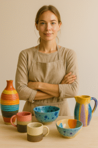
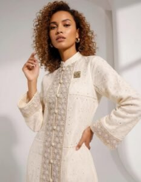

Partner with Arahkaii to reach the Muslim-owned Asian modern-luxury reader — a discerning audience for whom modest-luxury is the position, not the niche.

## Who We Are

Arahkaii is an eight-pillar Asian modern-luxury publication — Style, Beauty, Dining, Travel, Living, People, Culture, Guides — built on halal-aware editorial standards and an anti-AI-slop filter. Our readers expect cultural intelligence and plainly declared halal status, not lifestyle wallpaper.

## Why Advertise with Us?

- **Targeted Reach:** Engage an affluent Asian modern-luxury audience that prioritises craft, modesty, and considered consumption.
- **Authentic Integration:** Editorial-quality sponsored features in the same pillar voice as our reported pieces — not banner-style ad copy.
- **Multi-Channel Exposure:** Website, newsletter, Instagram, LinkedIn, Pinterest.
- **Flexible Campaigns:** Pillar-specific features, founder profiles, the Arahkaii Evening Edit slots, and bespoke partnerships.

## What We Do Not Run

We do not publish alcohol, bar, nightclub, wine, beer, cocktail, or nightlife advertising in any form. This is a permanent editorial position, not a negotiable.

## Advertising Opportunities

- Sponsored Articles & Brand Features
- Display Ads & Banners
- Newsletter Sponsorship
- Social Media & Influencer Campaigns
- Event Partnerships & Launch Amplification
- Pillar Takeovers (Style, Beauty, Dining, Travel, Living, People, Culture, Guides)

## Get in Touch

Ready to reach the Asian modern-luxury reader through editorial channels they actually trust? Contact our advertising team for media kits, pricing, and tailored proposals.

[Contact Us](mailto:advertise@arahkaii.com)
