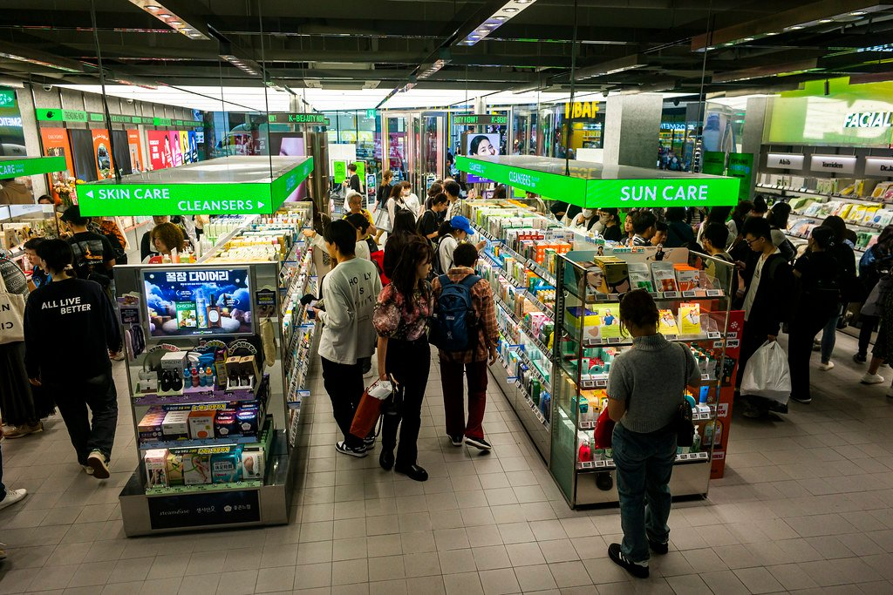

K-beauty didn't just change skincare routines—it rewired the entire global beauty industry from Seoul outward. _Your entire skincare routine was probably invented in Seoul. That's not an accident._

* * *

Look at your bathroom shelf. Really look at it. The snail mucin essence you panic-bought after seeing it on TikTok. The centella toner your friend swore fixed her skin. The sunscreen that doesn't leave a white cast. The cleansing balm that actually dissolves your makeup without making your eyes burn.

Now check where they're from.

Seoul. Seoul. Seoul. Seoul.

This isn't coincidence. It's not even really about the products themselves. Korea built a beauty system—a machine, really—that moves faster, thinks weirder, and markets smarter than anyone else on the planet. While L'Oréal spends 18 months developing a moisturizer, Korean brands are dropping new products every eight weeks. While Western beauty giants debate whether Gen Z will actually buy something called "snail mucin," Korean companies already tested it, scaled it, and moved on to salmon DNA.

Here's how a country smaller than Ohio became the undisputed capital of global skincare.

* * *

## The K-Beauty Speed Gap Is Actually Insane

Western beauty operates on what the industry calls "traditional development cycles." That's corporate speak for: really, really slow. A new product at a major Western brand takes 12 to 18 months to go from concept to shelf. There are focus groups. There are regional testing phases. There are meetings about the meetings. By the time a product launches, the trend that inspired it has already peaked on TikTok and been declared "cheugy" by someone with 2 million followers.

Korean beauty works differently.

The average K-beauty product goes from concept to consumer in eight weeks. Some companies do it in six. This isn't about cutting corners—Korean cosmetic safety standards are genuinely rigorous. It's about a fundamentally different approach to product development.

Korean brands operate more like fast fashion than traditional beauty. They spot a trend (or create one), develop a product, test it on a small scale, and ship it. If it hits, they scale. If it flops, they're already onto the next thing. The sunk cost of a failed product is measured in weeks, not years. This changes everything about how they take risks.

That centella serum that's now a staple in your routine? It probably went from "hey, centella is trending" to "available on Olive Young's shelves" faster than a Western brand could schedule the initial brainstorm.

* * *

## Why Korea Bets on Weird (And Wins)

Here's something Western beauty executives genuinely don't understand: Korean consumers aren't scared of weird ingredients. They're excited by them.

Snail mucin was laughed at when it first hit Western radar. The ick factor seemed insurmountable. But Korean consumers had already embraced it, tested it, reviewed it obsessively, and moved on. By the time Westerners got over themselves, snail mucin had years of real-world data from millions of Korean users proving it actually worked.

The same pattern repeats. Bee venom. Fermented yeast. Starfish extract. Salmon DNA (yes, really—it's called PDRN and it's having a moment). Each of these ingredients sounded absurd to Western ears but had already been validated in what is essentially the world's largest live skincare laboratory: Korean consumers.

PDRN—polydeoxyribonucleotide, if you want to impress someone—is the current frontier. Derived from salmon reproductive cells (look, you asked), it's being positioned as the next big anti-aging breakthrough. Korean brands are already deep into PDRN serums, under-eye patches, and ampoules. Western brands are still at the "wait, what is that?" stage. By the time they catch up, Korea will have moved on to something even more improbable.

The Korean beauty consumer is essentially a beta tester who pays for the privilege. They try new things obsessively, review them exhaustively online, and create real-time feedback loops that Western R&D departments can only dream of. A product that fails in Korea fails fast and quiet. A product that succeeds has already been stress-tested by some of the most demanding skincare consumers on Earth.

* * *

## The Olive Young Effect

If you want to understand why K-beauty moves so fast, you need to understand Olive Young.

Olive Young is Korea's dominant beauty retailer—think Sephora, but more accessible, more experimental, and more influential. With over 1,300 stores across Korea, it's where trends are made and broken. Landing on Olive Young's shelves is make-or-break for Korean brands. Getting featured in their monthly rankings can turn an unknown product into a sellout overnight.

But here's what makes Olive Young different from Western retailers: speed and flexibility. The retailer rotates products constantly, creates viral "best of" rankings that consumers actually trust, and isn't afraid to give shelf space to tiny brands with one interesting product. Western retailers like Sephora and Ulta have buying cycles measured in seasons. Olive Young operates more like an algorithm—constantly optimizing for what's working right now.

This creates a brutal but effective ecosystem. Brands that can't keep up get pushed out. Brands that can read trends and execute quickly get amplified. The result is a retail environment that selects for exactly the kind of agility that makes K-beauty so hard to compete with.

When Olive Young's "Global" platform launched—bringing Korean products directly to international consumers—it essentially exported this whole system. Now you can order what's trending in Myeongdong and have it in your bathroom within a week.

* * *

## TikTok Was Made for This

K-beauty didn't just adapt to TikTok. It was already perfectly formatted for it.

Think about what makes a product go viral on TikTok. It needs to be visually interesting. It needs to have an immediate, demonstrable effect. It needs a story—ideally a slightly weird one. It needs to be affordable enough that people can impulse-buy it. And it needs to be available quickly, before the trend moves on.

K-beauty checked every box before TikTok even existed.

Korean products have always been designed for visual impact. The textures, the packaging, the satisfying way essences absorb or cleansing balms emulsify—this wasn't accidental. Korean consumers documented their routines online long before "get ready with me" was a genre. The 10-step routine, whether you actually do all 10 steps or not, was inherently content-friendly.

> [@songofskin](https://www.tiktok.com/@songofskin?refer=embed "@songofskin") If I was new to skincare this is exactly what I would use 🫧✨ Korean beauty is my absolute favorite and this is the best routine for beginners [#skincare](https://www.tiktok.com/tag/skincare?refer=embed "skincare") [#glassskin](https://www.tiktok.com/tag/glassskin?refer=embed "glassskin") [#glowyskin](https://www.tiktok.com/tag/glowyskin?refer=embed "glowyskin") [#koreanbeauty](https://www.tiktok.com/tag/koreanbeauty?refer=embed "koreanbeauty") [#essence](https://www.tiktok.com/tag/essence?refer=embed "essence") [#texturedskin](https://www.tiktok.com/tag/texturedskin?refer=embed "texturedskin") [#acne](https://www.tiktok.com/tag/acne?refer=embed "acne") [#skincareroutine](https://www.tiktok.com/tag/skincareroutine?refer=embed "skincareroutine") [#skincareforbeginners](https://www.tiktok.com/tag/skincareforbeginners?refer=embed "skincareforbeginners") [♬ original sound - Song Of Skin](https://www.tiktok.com/music/original-sound-7341518256680799022?refer=embed "♬ original sound - Song Of Skin")

When TikTok arrived, K-beauty already had a decade of shareable content conventions. It had products that photographed well, ingredients that demanded explanation (algorithmic catnip), and price points that removed purchase friction. The [COSRX](https://www.cosrx.com) Snail Mucin Essence didn't go viral because of a marketing campaign. It went viral because the product itself was engineered—probably unintentionally—for exactly how beauty content spreads in 2024.

Western brands are now desperately trying to create "TikTok-friendly" products. Korean brands just kept doing what they were already doing.

* * *

## The System Behind the Products

Here's what gets missed when people talk about K-beauty: it's not just about individual products or even individual brands. It's about a system.

Korea has built an entire ecosystem around skincare. Government support for the cosmetics industry is real—exports topped $10 billion in 2024, making beauty one of Korea's most successful export categories. Universities have dedicated cosmetic science programs feeding talent into the industry. The supply chain, from ingredient manufacturers to packaging companies, is concentrated and efficient. Everything is optimized for speed.

Korean companies also share resources in ways that would be unthinkable in the West. Many brands use the same OEM manufacturers, which means innovations spread quickly across the industry. When one manufacturer develops a new texture or delivery system, multiple brands can launch products using it almost simultaneously. This sounds like it would reduce differentiation, but in practice, it accelerates innovation industry-wide.

The culture around skincare is different too. In Korea, skincare isn't vanity—it's baseline self-care, like brushing your teeth. This creates a market where consumers are genuinely knowledgeable, genuinely demanding, and genuinely willing to try new things. It's exhausting to compete against, honestly.

* * *

## What This Means For Your Shelf

The K-beauty dominance isn't slowing down. Korean skincare exports grew over 20 percent last year. Korean brands are expanding beyond Asia into Europe and the Middle East. The innovation pipeline—microbiome skincare, spicule delivery systems, exosome technology—is already being tested on Korean consumers while Western brands are still figuring out how to pronounce "PDRN."

For you, the consumer, this is mostly good news. Competition keeps prices reasonable. Innovation is constant. The things that work actually work, because they've been tested by millions of demanding consumers before reaching you.

The products on your shelf aren't there because of marketing budgets or celebrity deals. They're there because Korea built a system that produces better skincare, faster, at prices that make impulse-buying a reasonable life choice.

Your bathroom is basically a Korean export showcase. And honestly? There are worse countries to outsource your skincare routine to.

* * *

_The COSRX Snail Mucin Essence you bought because TikTok told you to? Korea's been using it for over a decade. You're just catching up._

### Related Reading

- [10 Korean Fashion Brands Building Global Empires](https://www.arahkaii.com/korean-fashion-brands-2026/)
- [Seoul Fashion Week F/W 2026](https://www.arahkaii.com/seoul-fashion-week-fw-2026/)
- [C-Beauty vs K-Beauty 2026](https://www.arahkaii.com/c-beauty-vs-k-beauty-2026/)

### Read next

- [C-Beauty vs K-Beauty 2026: The New Asian Beauty Showdown](https://www.arahkaii.com/beauty/c-beauty-vs-k-beauty-2026/)
- [Best Chinese Makeup Brands 2026: Judydoll, Florasis & C-Beauty Worth Buying](https://www.arahkaii.com/beauty/beauty-best-chinese-makeup-brands/)
- [The Accidental It Bag: Inside the $3 Tote That Broke Luxury’s Playbook](https://www.arahkaii.com/fashion/the-accidental-it-bag-inside-the-3-tote-that-broke-luxurys-playbook/)
- [The Ultimate Guide to Finding the Perfect Foundation Shade for Southeast Asian](https://www.arahkaii.com/beauty/the-ultimate-guide-to-finding-the-perfect-foundation-shade-for-southeast-asian-skin-tones/)
