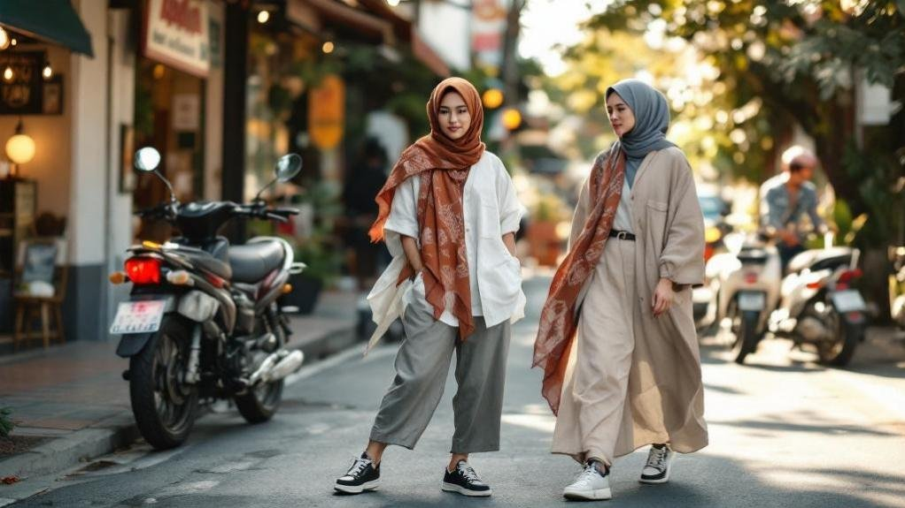
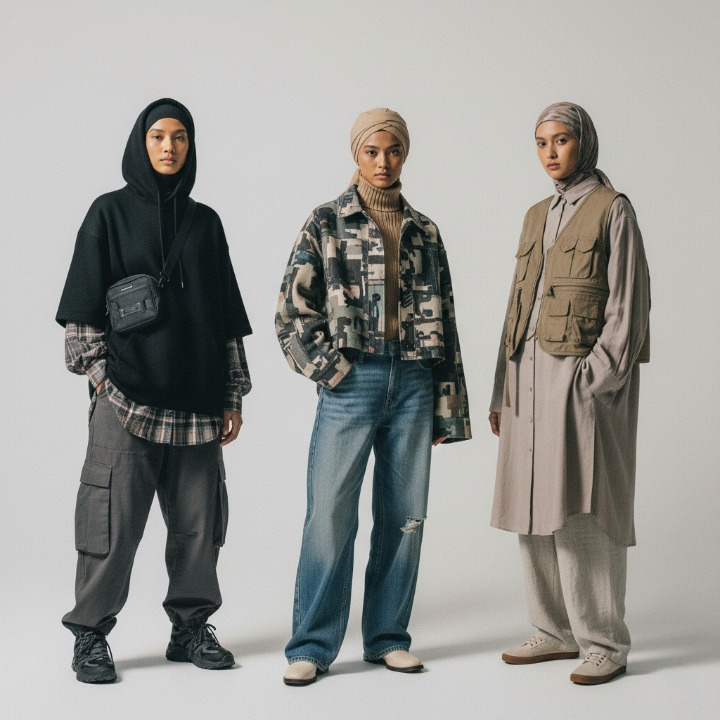
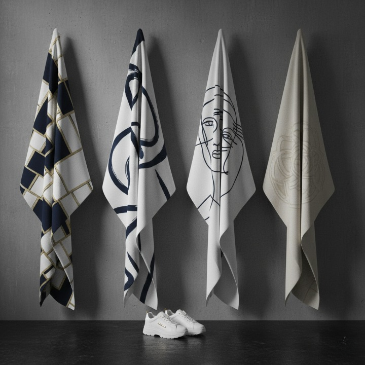
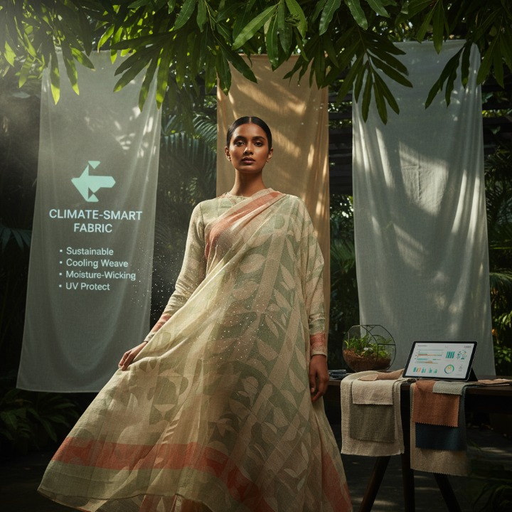
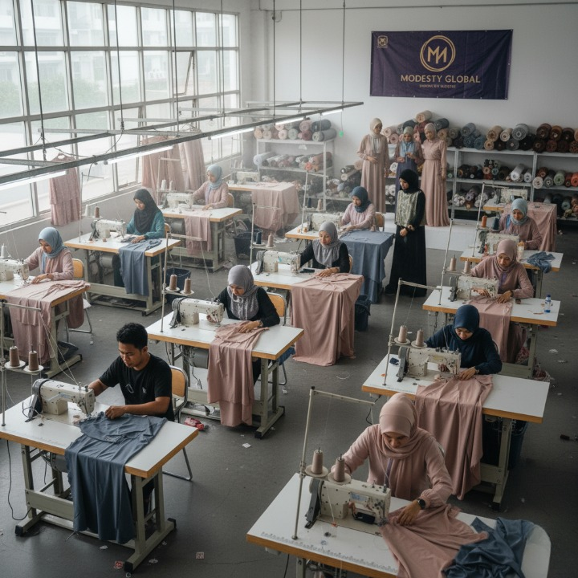
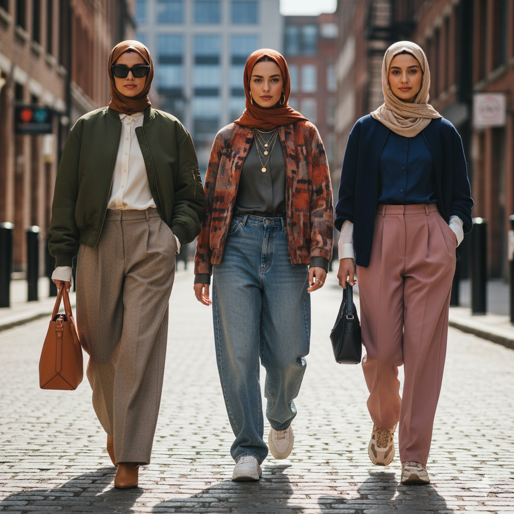

## Southeast Asia's Emergence as a Global Modest Fashion Leader

When you think about fashion capitals, you probably picture Paris, Milan, or New York—but that's shifting. Southeast Asia is emerging as a genuine global modest fashion powerhouse. Indonesia now leads worldwide modest fashion rankings, surpassing traditional strongholds like Italy and Turkey.

Modest streetwear in Southeast Asia is redefining what it means to dress both faithfully and fashionably in one of the world’s fastest-growing markets. This transformation stems from strategic cultural exchange and design collaborations that blend local traditions with contemporary streetwear aesthetics.

Events like Jakarta Muslim Fashion Week showcase over 100 designers presenting 1,000 collections annually. You'll find brands like Pestle & Mortar Clothing and SWE integrating modest silhouettes into urban styles that resonate with young consumers.

The region's market trends reveal growing brand evolution driven by consumer preferences for authenticity. Fashion technology and innovative production methods support emerging designers.

This momentum positions Southeast Asia as you and other fashion enthusiasts should recognize—a legitimate trendsetter reshaping global modest fashion narratives.

## Modest Streetwear in Southeast Asia: Blending Urban Style With Cultural Modesty: the Streetwear Evolution

Southeast Asian designers are revolutionizing modest streetwear by weaving together practical fabrics, meaningful graphics, and silhouettes that celebrate who you are.

You'll find brands like Pestle & Mortar Clothing and SWE using breathable materials such as viscose and satin while embedding local cultural narratives into their designs, creating pieces that work for both tropical climates and your personal identity.

Through this evolution, you're witnessing fashion that doesn't ask you to choose between urban style and cultural values—it gives you both.

### Fabrics Meet Function

There's something genuinely exciting happening in Southeast Asia's fashion scene right now. Designers are smartly choosing functional fabrics that work hard for the climate and lifestyle you're living in.

Breathable materials like viscose, satin, and crepe keep you cool in humid tropical weather while maintaining modest coverage. You get comfort without compromise. Elastic panels and airy silhouettes let you move freely, layer easily, and stay formal when needed.

The genius lies in simplicity. Minimalist cuts mean you can dress up or down. Bold color blocking adds personality while keeping things practical. Metallic touches bring subtle glamour without overheating you.

These aren't just clothes—they're solutions designed for how you actually live. Southeast Asian brands understand that function and fashion don't have to compete.

### Graphics Tell Stories

Graphics on modest streetwear aren't just decorative—they're conversations between designers and wearers. Brands like Kaobeiking transform simple garments into cultural statements through witty text and locally resonant imagery. You'll find visual narratives embedded in everything from playful Southeast Asian slang to references celebrating regional heritage.

These designs serve a purpose beyond aesthetics. They let you express your identity while honoring modest principles. Vietnamese brand SWE uses bold graphic expression featuring rainforest motifs and traditional patterns, connecting urban youth to ancestral stories.

Malaysian labels incorporate humor that speaks directly to young Muslim consumers, making you feel seen and understood.

When you wear modest streetwear with meaningful graphics, you're not just following fashion—you're wearing your culture proudly. You're part of a movement redefining what Muslim fashion represents globally.

### Silhouettes Embrace Identity

When you slip on a loose-fitting hoodie paired with tapered pants, you're experiencing the evolution of modest streetwear—a style that refuses to choose between urban edge and cultural respect.

Southeast Asian designers champion silhouette diversity by creating shapes that honor both traditions and contemporary trends. You'll notice how brands like SWE and Pestle & Mortar Clothing reshape what modest clothing means to young Muslims today.

These silhouettes work through:

1. Oversized tops layered with fitted bottoms for balanced proportions
2. Flowing fabrics that move with your body without clinging
3. Strategic length and coverage that feels naturally comfortable
4. Relaxed cuts celebrating different body types equally

This approach transforms cultural expression from restrictive to liberating. Your identity shines through clothing that respects your values while letting you move freely through city streets.

## Climate-Smart Design: Fabric Innovations for Tropical Living

Southeast Asian modest streetwear designers face a unique challenge: keeping you cool and covered in some of the world's hottest, most humid climates. They've turned this obstacle into opportunity through smart fabric choices.

Lightweight materials like satin, viscose, and crepe let air flow freely while maintaining your modest coverage. These breathable options prevent overheating without compromising style or cultural values.

Designers also prioritize fabric sustainability, selecting recycled and eco-conscious materials that respect both you and the environment.

Elastic panels and airy silhouettes offer comfort without sacrificing formality. You'll find bold color blocking paired with breathable designs, honoring vibrant cultural preferences while keeping you comfortable all day.

Subtle metallic accents add glamour without trapping heat. This climate adaptability makes modest streetwear practical for real life—not just runways.

## Storytelling Through Fashion: Cultural Identity in Every Stitch

Every piece you wear tells a story—that's the philosophy driving modest streetwear designers across Southeast Asia.

These designers weave narrative aesthetics into their collections, transforming garments into cultural statements. You'll find identity expression woven throughout Southeast Asian modest streetwear through:

1. Local motifs reflecting rainforest imagery and traditional embroidery patterns
2. Linguistic elements and humor that resonate with regional audiences
3. Historical references celebrating Southeast Asian heritage and communities
4. East-West fusion designs bridging global and local perspectives

Brands like Pestle & Mortar Clothing and Kaobeiking embed storytelling directly into their designs.

You're not just wearing clothes—you're wearing your culture's voice. Each graphic, color choice, and silhouette connects you to your roots while expressing contemporary identity.

This approach transforms modest streetwear into authentic cultural celebration, making fashion deeply personal and meaningful for young Muslim consumers across the region.

## Economic Growth and Empowerment Through Modest Fashion

Beyond the cultural narratives stitched into every garment, there's a powerful economic story unfolding across Southeast Asia's modest fashion scene. You're witnessing grassroots initiatives transforming local communities through fashion entrepreneurship.

| Market Segment | Employment Opportunities | Regional Impact |
| --- | --- | --- |
| UMKM Production | Design, manufacturing, distribution jobs | Indonesia leads with 100+ designers |
| Retail & E-commerce | Sales, customer service, logistics roles | Southeast Asia's billion-dollar growth |
| Textile & Materials | Fabric sourcing, sustainable production | Supporting local artisans and suppliers |

Small businesses aren't just producing clothing—they're creating pathways for economic empowerment. You'll find designers, manufacturers, and entrepreneurs collaborating to build something meaningful. Jakarta Muslim Fashion Week's 8,000 visitors represent market demand that's fueling real jobs and genuine opportunity. These grassroots initiatives prove that modest fashion isn't merely a trend; it's fundamentally reshaping how Southeast Asia participates in the global economy while staying true to its values.

## Sustainability and Innovation: The Future of Modest Streetwear

As young consumers demand more from the brands they wear, modest streetwear designers across Southeast Asia are stepping up with creative solutions that don't compromise on style or values.

> Young consumers are demanding more—and Southeast Asian modest streetwear designers are delivering style without compromising values.

You're seeing a shift toward responsible fashion that matters: For further reading, see [Modest Fashion Weeks](https://www.modestfashionweek.com).

1. Recycled fabrics replace virgin materials, reducing waste and environmental impact.
2. Small-batch production guarantees quality while supporting local artisans sustainably.
3. Ethical sourcing ensures fair wages and safe working conditions throughout supply chains.
4. Modular designs let you mix and match pieces, extending garment lifespans.

Circular fashion principles reshape how brands operate. Designers now create versatile clothing that adapts to your lifestyle while respecting the planet.

This isn't just trend-chasing—it's genuine innovation meeting conscience. Southeast Asian modest streetwear demonstrates you don't sacrifice values for style.

### Related Reading

- [The Batik Paradox: Authenticity and Technology](https://www.arahkaii.com/batik-blockchain-indonesia-textile-authenticity-technology/)
- [Jakarta Fashion Week 2025](https://www.arahkaii.com/jakarta-fashion-week-2025/)
- [Inside SukkhaCitta's Radical Reinvention of Fashion](https://www.arahkaii.com/sukkhacitta-regenerative-fashion-indonesia-artisan-economics/)
